# NUS SAVNAC DOCUMENTATION
<p align="center">
  
</p>

*Team name*
**SchedWarden**

*Project name*
**NUS Savnac**

*Production*
https://nus-savnac.vercel.app/

*For testing purposes, please use the below account*
*Email: test@gmail.com*
*Password: 123456*

# Table of Contents
1. [Introduction](#1-introduction)
  - [Motivation](#11-motivation)
  - [Project Overview](#12-project-overview)
  - [Expectations](#13-expectations)
2. [System Design](#2-system-design)
  - [Overall Architecture](#21-overall-architecture)
  - [Technology Stack](#22-technology-stack)
  - [Authentication Design](#23-authentication-design)
3. [Feature Implementation](#3-feature-implementation)
  - [User Authentication](#31-user-authentication)
  - [Course Management](#32-course-management)
  - [Resource Management](#33-resource-management)
  - [Scheduler](#34-scheduler)
  - [Task Management](#35-task-management)
  - [Pomodoro Timer](#36-pomodoro-timer)
4. [User Guide](#4-user-guide)
5. [Testing](#5-testing)
  - [Integration Testing](#51-integration-testing)
  - [Component Testing](#52-component-testing)
  - [End To End Testing](#53-end-to-end-testing)

## 1. Introduction

### 1.1 Motivation

The current learning ecosystem at the **National University of Singapore (NUS)** relies heavily on platforms such as ***Canvas*** and external systems such as ***Coursemology***. While these platforms provide essential functionality for course administration and content delivery, their usage often varies significantly across modules due to differences in teaching styles and course requirements. As a result, students are frequently required to navigate multiple platforms in order to access learning materials, submit assignments, complete quizzes, and track academic progress.

Furthermore, ***Canvas*** does not provide a centralized view of a student's overall academic workload. Important responsibilities such as tutorial preparation, revision sessions, project milestones, and self-directed study are often managed separately by students. This challenge is especially apparent for freshmen, who are still adapting to the increased independence and workload associated with university education.

Another limitation lies in the organization of learning resources. Although Canvas provides a *Files* section for course materials, resources are often stored within deeply nested folder structures. Students may need to repeatedly navigate through multiple layers of folders to access frequently used documents, resulting in an inefficient and repetitive workflow.

In addition, Canvas lacks integrated tools for long-term study planning, task management, and productivity tracking. Students are therefore required to rely on external applications such as calendars, task managers, and productivity tools to organize their academic commitments. The use of multiple disconnected systems creates fragmented workflows and increases the cognitive effort required to manage university life effectively.

These limitations motivated the development of **NUS Savnac**, a centralized academic management platform that aims to streamline academic organization, improve productivity, and provide students with a more unified learning experience.

### 1.2 Project Overview

***NUS Savnac*** is an academic management platform designed specifically for students of the **National University of Singapore**. The platform aims to centralize course information, study resources, schedules, and task management tools within a single application, reducing the need for students to switch between multiple systems throughout their daily academic activities.

The name *Savnac* is derived from the reverse spelling of *Canvas*, reflecting the project's goal of complementing and extending the functionality provided by the university's primary learning management system. Rather than replacing Canvas, NUS Savnac acts as a productivity-focused companion platform that helps students organize their academic responsibilities more efficiently.

The platform consists of four core features:

* **Dashboard** – Serves as the central hub of the application. Students can add NUS modules, organize course-specific resources, create custom folders containing external links, and access module information retrieved from NUSMods. The dashboard also provides a consolidated view of upcoming academic activities and course-related tasks.

* **Scheduler** – A semester-based scheduling system aligned with the NUS Academic Calendar. The scheduler aggregates module schedules and user-created events into a unified timeline, allowing students to plan their study routines and monitor upcoming commitments.

* **Task Management** – A centralized task-tracking interface that consolidates assignments, deadlines, and personal tasks across all registered courses. Tasks are organized in a structured manner to help students monitor their academic progress and maintain productivity throughout the semester.

* **Pomodoro Timer** – Enables users to create focused study sessions by allocating time blocks to specific tasks. This feature encourages effective time management and minimizes distractions during study periods.


Beyond its core functionality, NUS Savnac also incorporates several productivity-enhancing features:

* **Reminder System** – An automated notification system that monitors upcoming deadlines and events. Users can configure reminder intervals according to their preferences, and notifications are delivered through email to ensure important deadlines are not overlooked.

* **AI Advising System** – Assists students in planning their schedules and academic workload by generating personalized recommendations for study routines and task prioritization.

* **Voice Command System** – Provides a collection of predefined voice commands that allow users to interact with selected system functionalities through voice-based input, improving accessibility and convenience.

By combining academic management, scheduling, productivity tools, and intelligent assistance within a single platform, NUS Savnac aims to reduce administrative overhead and allow students to focus more effectively on learning.

### 1.3 Expectations

NUS Savnac is designed to serve as a comprehensive academic companion for NUS students. The project aims to improve the way students organize, manage, and track their academic responsibilities throughout the semester.

The system is expected to:

* Provide a centralized platform for managing courses, schedules, tasks, and study resources.
* Reduce the effort required to navigate between multiple academic systems and applications.
* Improve visibility of upcoming deadlines, events, and academic commitments.
* Encourage productive study habits through integrated productivity tools such as the Pomodoro Timer and Reminder System.
* Assist students in planning and prioritizing their workload through intelligent scheduling recommendations.
* Minimize the likelihood of missed deadlines and overlooked academic responsibilities.
* Deliver a more organized and efficient academic experience for students throughout their university journey.

Ultimately, the project seeks to reduce cognitive load associated with academic management and enable students to dedicate more time and attention to meaningful learning activities.

## 2. System Design
### 2.1. Overall Architecture
The overall architecture of the system is shown below.

<p align="center">
  
</p>

<p align="center">
  <em>Figure 1. Overall System Architecture</em>
</p>

The NUS Savnac system consists of four main components: the frontend application, backend services, database, and background job processing system. Users interact with the platform through a Next.js frontend, which communicates with backend services and external data sources such as the NUSMods API.

User data, tasks, events, folders, and course information are stored in a PostgreSQL database hosted on Neon. To support automated reminders, BullMQ and Redis are used to process background jobs and deliver scheduled email notifications. This architecture provides a clear separation between user interaction, data management, and asynchronous processing, ensuring maintainability and scalability.


### 2.2. Technology Stack

#### Frontend

* ***Next.js***
  A React-based framework used to build the frontend application. Next.js was chosen for its modern routing system, server-side rendering capabilities, and seamless integration with the React ecosystem.

* ***Tailwind CSS***
  A utility-first CSS framework used for styling the application. Tailwind CSS enables rapid UI development while maintaining a consistent and scalable design system.

* ***shadcn/ui***
  A collection of reusable and customizable UI components built on top of Radix UI and Tailwind CSS. It was selected to accelerate development while maintaining full control over component styling and behavior.

* ***Framer Motion***
  An animation library used to create smooth transitions and interactive user experiences. Framer Motion helps improve the overall usability and visual appeal of the application.

#### Backend

* ***NestJS***
  A progressive Node.js framework used to build the backend services. NestJS was chosen for its modular architecture, strong TypeScript support, and maintainable project structure.

* ***NUSMods API***
  An external API that provides module, timetable, and academic information from NUS. It serves as the primary source of module-related data within the application.

#### Database

* ***PostgreSQL***
  A relational database management system used for persistent data storage. PostgreSQL was selected for its reliability, performance, and strong support for complex relational data.

* ***Prisma***
  A type-safe ORM used to interact with the PostgreSQL database. Prisma simplifies database operations while improving developer productivity and reducing the likelihood of runtime errors.

#### Background Jobs

* ***BullMQ***
  A Redis-based job queue used for scheduling and processing asynchronous tasks. BullMQ enables the application to handle background operations without affecting user-facing performance.

* ***Redis***
  An in-memory data store used by BullMQ for queue management and job persistence. Redis provides high performance and low latency for background task processing.

#### Authentication

* ***Auth.js***
  An authentication framework used to manage user authentication and session handling. Auth.js was chosen for its seamless integration with Next.js and support for multiple authentication providers.

  * *Credentials (Username and Password)*
    Provides traditional account-based authentication, allowing users to securely register and log in using their email and password.


#### Deployment

* ***Vercel***
  The hosting platform used for deploying the frontend application. Vercel offers optimized support for Next.js applications and provides a streamlined deployment workflow.

* ***Railway***
  A cloud platform used to host backend services and supporting infrastructure. Railway simplifies service deployment and environment management.

* ***Neon***
  A serverless PostgreSQL platform used to host the application's database. Neon was selected for its scalability, ease of management, and seamless integration with modern cloud workflows.

#### Developer Tools

* ***Git/GitHub***
  Used for version control and collaborative development. Git and GitHub facilitate code management, feature branching, and team collaboration throughout the project lifecycle.

* ***Jest***
  A testing framework used for writing and executing unit tests. Jest helps ensure the correctness and reliability of application logic.

* ***Supertest***
  A library used for API and integration testing. Supertest allows backend endpoints to be tested in an automated and reproducible manner.


### 2.3. Authentication design
The design for authentication system is shown as below.
<p align="center">
  
</p>

<p align="center">
  <em>Figure 2. Authentication System Design</em>
</p>

This authentication design implements a secure credentials (email and password) registration and login system using a layered architecture. Users can sign in through the login page, where credentials are validated and authenticated against stored account data.

For new registrations, user information is validated, the password is encrypted, and a one-time password (OTP) is generated and sent via email. Registration data is temporarily stored in a `pending users` table until OTP verification is completed. Once verified, a new user record is created in the main `users` table. The system separates responsibilities across frontend, authentication middleware, controller, service, and database layers, improving maintainability, scalability, and security.

## 3. Feature Implementation
### 3.1. User Authentication
#### 3.1.1. Feature Overview
The **User Authentication** feature enables users to securely access and manage their accounts within ***NUS Savnac***. The system is built on a credentials-based authentication mechanism, allowing users to sign up and log in using their email and password.

To enhance security and ensure the validity of user accounts, the registration process includes email-based *One-Time Password (OTP)* verification. Users are required to verify their email address before completing the account creation process.

Authentication is a prerequisite for accessing protected features within the system, including the course management dashboard, scheduling tools, and task tracking functionalities.

<p align="center">
  
</p>

<p align="center">
  <em>Figure 3.1. Login Page</em>
</p>


<p align="center">
  
</p>

<p align="center">
  <em>Figure 3.2. Register Page</em>
</p>

<p align="center">
  
</p>

<p align="center">
  <em>Figure 3.3. Email Verification Page</em>
</p>

#### 3.1.2. Key Functionalities
- User registration by email and password
- Email OTP verification
- User login using emal and password
- Secure session management by Auth.js

#### 3.1.3. Technical Implementation
##### Credentials-Based Authentication

The credentials authentication workflow is implemented using Auth.js, PostgreSQL, and Prisma. This authentication method allows users to create and access accounts using an email-password combination.

**Login Flow**

* Users submit their email and password through the login form.
* The frontend performs basic input validation before forwarding the authentication request to Auth.js.
* Auth.js invokes the custom credentials provider, which communicates with the backend authentication service.
* The backend queries the `users` table through Prisma to retrieve the corresponding user record.
* The submitted password is compared against the stored password hash using a secure password verification algorithm.
* Upon successful verification, Auth.js creates a user session and grants access to protected application routes.
* Invalid credentials result in an authentication failure response and the user remains on the login page.

**Registration Flow**

* Users provide a display name, email address, and password through the registration form.
* Input validation is performed to ensure all required fields are present and satisfy security requirements.
* Email is restricted to be NUS email, ending with @u.nus.edu
* Passwords must:
  * Contain at least 8 characters
  * Include at least one uppercase letter
  * Include at least one lowercase letter
  * Include at least one numeric character
  * Include at least one special character
* The registration request is submitted to the `/auth/register` endpoint.
* The backend verifies that the email address is not already associated with an existing account.
* The password is securely hashed before any user data is persisted.
* A One-Time Password (OTP) is generated for email verification.
* The OTP is sent to the user's email address, while the registration information is temporarily stored in the `pending users` table through Prisma.
* Users are redirected to the verification page and must provide the received OTP.
* The verification request is submitted to the `/auth/verify` endpoint.
* The backend validates the submitted OTP against the corresponding verification record stored in the database.
* Upon successful verification, the pending registration record is promoted to a permanent account by creating a new entry in the `users` table.
* If verification fails or the OTP has expired, the account creation process is not completed and the user must request a new verification code.

### 3.2 Course Management

#### 3.2.1 Feature Overview

Course Management is one of the core features of **NUS Savnac**, serving as the entry point for users to build and organize their academic workspace. Instead of manually creating course information, the system integrates with the **NUSMods API** to retrieve official module data directly from NUS. This allows students to quickly import their enrolled modules while ensuring that all course information remains accurate and up to date.

Each imported course acts as a central workspace where users can later organize study resources, manage course-specific tasks, and schedule academic events. By automatically synchronizing essential module information, Course Management significantly reduces the amount of manual setup required at the beginning of every semester.

**Key capabilities include:**

* Import NUS modules directly from NUSMods.
* Display official course information, including module credits, workload distribution, and examination dates.
* Maintain a personalized dashboard containing all enrolled modules.
* Allow users to rename or remove courses from their dashboard.

<p align="center">
  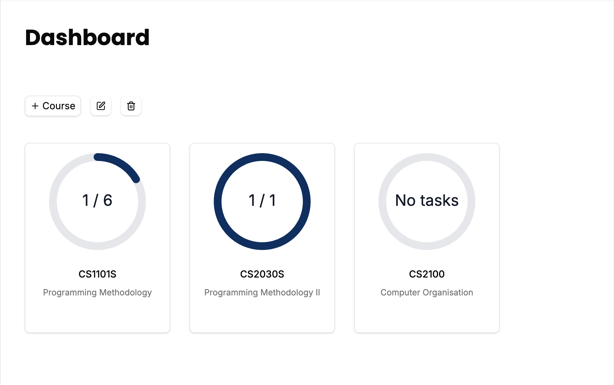
</p>
<p align="center">
  <em>Figure 4.1. Imported NUS Courses</em>
</p>

---

#### 3.2.2 Key Functionalities

The Course Management module provides the following functionalities:

* **Import NUS Modules**
  Users can search for and add official NUS modules directly from the NUSMods database without manually entering course information.

* **Course Information Display**
  Each course displays essential academic information such as module code, module title, modular credits, workload distribution, and examination details.

* **Course Navigation**
  Selecting a course opens the course details page, which serves as the central workspace for managing resources, events, and tasks related to that module.

* **Course Management**
  Users may update the displayed course name or remove courses from their dashboard whenever necessary.

<p align="center">
  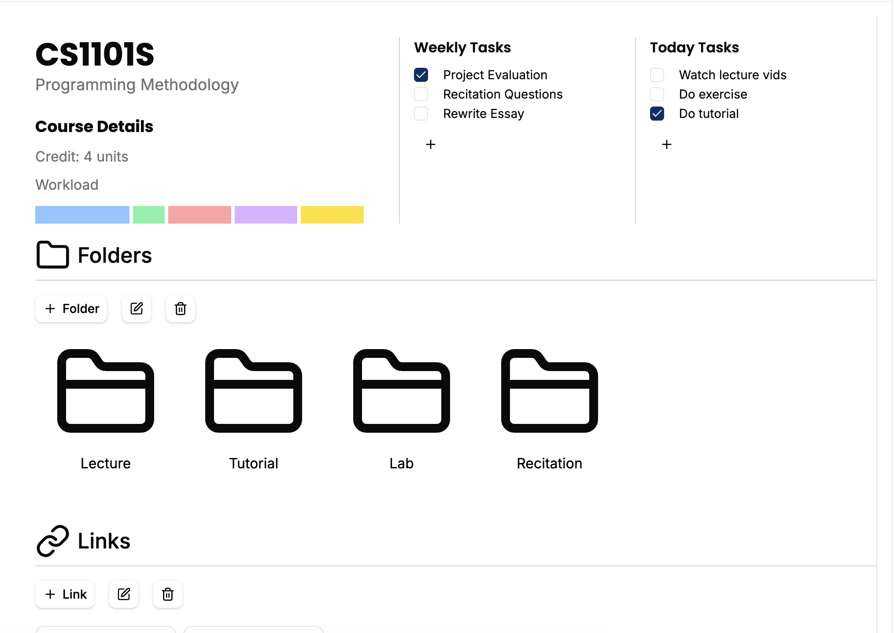
</p>
<p align="center">
  <em>Figure 4.2. Course Details Page</em>
</p>

---

#### 3.2.3 Technical Implementation

The Course Management module follows a client-server architecture, where the frontend communicates with the backend through RESTful APIs while course information is persisted in the PostgreSQL database.

##### Grid-based Interaction System

To provide a consistent user experience throughout the application, NUS Savnac adopts a reusable **grid-based interaction model**. Resources such as courses, folders, and links are displayed as interactive grid items that operate under three interaction modes:

* **Normal Mode** – Selecting an item opens its corresponding content.
* **Edit Mode** – Selecting an item allows users to modify its information.
* **Delete Mode** – Selecting an item removes the corresponding resource after confirmation.

This interaction model is reused across multiple features within the application, providing a consistent interface while reducing duplicated frontend logic.

<p align="center">
  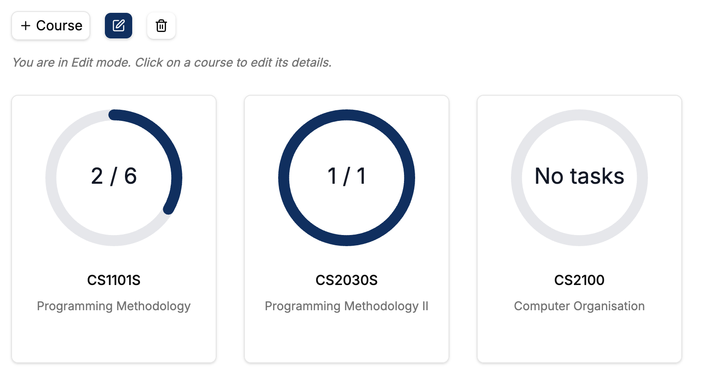
</p>
<p align="center">
  <em>Figure 4.3. Course Grid in Edit Mode</em>
</p>

<p align="center">
  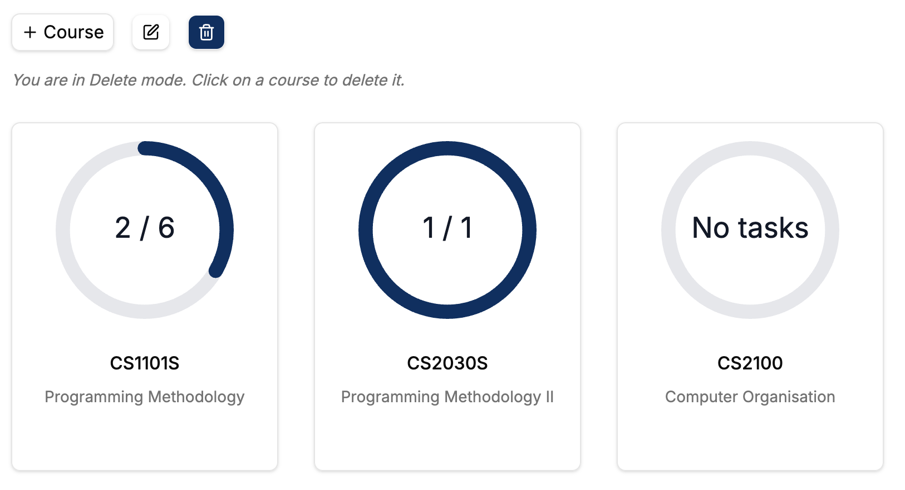
</p>
<p align="center">
  <em>Figure 4.4. Course Grid in Delete Mode</em>
</p>

---

##### Loading User Courses

When the Dashboard page is initialized, the frontend automatically retrieves all courses associated with the authenticated user by sending a request to:

```text
GET /api/course/all-courses
```

The backend queries the **Course** table using the authenticated user's `userId` and returns all previously added courses. The returned dataset is then rendered as the course grid on the Dashboard.

---

##### Importing Modules from NUSMods

Instead of maintaining a local catalogue of NUS modules, NUS Savnac retrieves official module information directly from the **NUSMods API**.

To populate the module selection dialog, the frontend requests:

```text
https://api.nusmods.com/v2/2025-2026/moduleList.json
```

The returned module list is cached on the client and presented through a searchable interface, allowing users to quickly locate modules by typing their module codes.

<p align="center">
  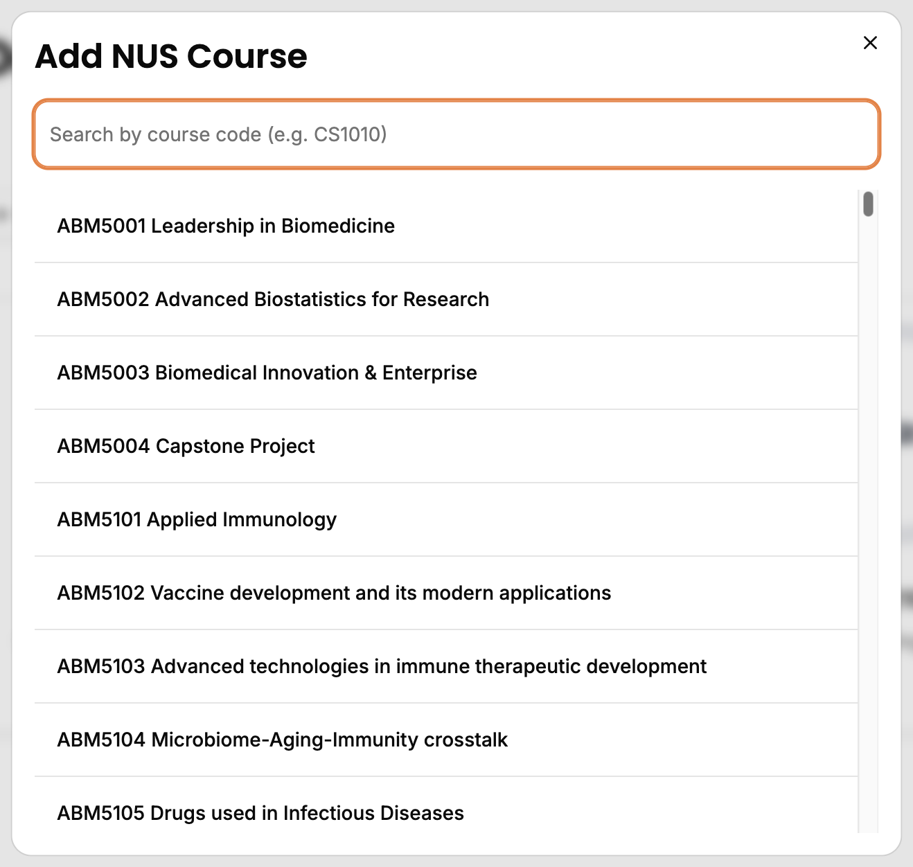
</p>
<p align="center">
  <em>Figure 4.5. Adding NUS Courses Dialog</em>
</p>

Once a module is selected, the frontend submits the request to:

```text
POST /api/course/add-course
```

The backend creates a new course record through Prisma and stores it in the **Course** table within the PostgreSQL database. After the operation completes successfully, the Dashboard is refreshed to display the newly added course.

---

##### Retrieving Course Information

Selecting a course navigates users to the Course Details page. Upon loading the page, the frontend retrieves the latest module information from NUSMods using the module code.

For example:

```text
https://api.nusmods.com/v2/2025-2026/modules/CS1101S.json
```

Although the endpoint returns comprehensive module information, NUS Savnac extracts only the fields required by the application:

| Field          | Purpose                                               |
| -------------- | ----------------------------------------------------- |
| `moduleCode`   | Display the official module code                      |
| `title`        | Display the module title                              |
| `workload`     | Visualize weekly workload distribution                |
| `moduleCredit` | Display the number of modular credits                 |
| `semesterData` | Generate class schedules used by the Scheduler module |

The first four fields are displayed directly on the Course Details page, while `semesterData` is transformed into the application's internal event format and later consumed by the **Scheduler** module when users choose to import course classes.

<p align="center">
  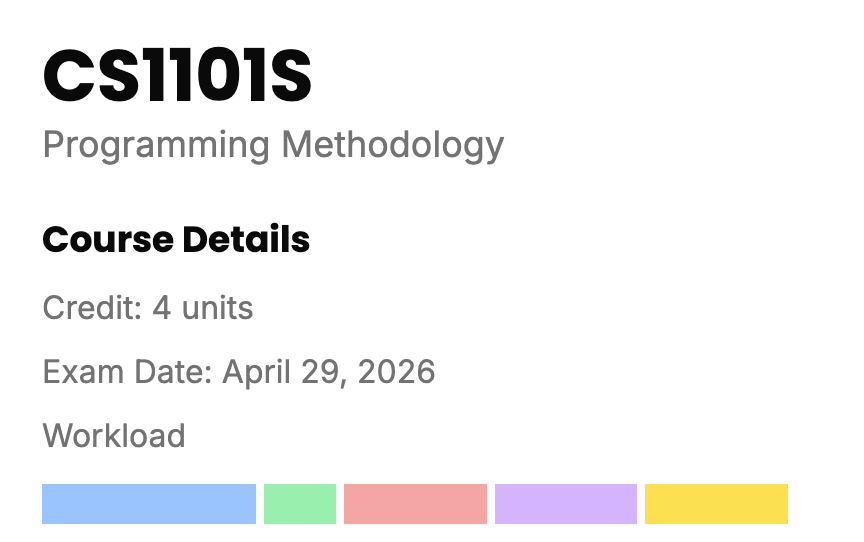
</p>
<p align="center">
  <em>Figure 4.6. Course Information Section</em>
</p>

---

##### Course Deletion

When a user removes a course, the frontend submits the corresponding `courseId` to:

```text
POST /api/course/delete-course
```

The backend deletes the corresponding record from the **Course** table. Associated course resources, including folders, links, events, and tasks, are also removed through database cascade relationships, ensuring data consistency throughout the system.

<p align="center">
  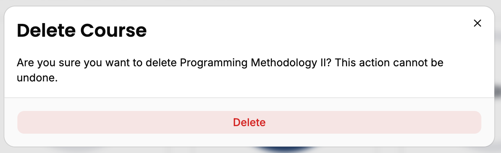
</p>
<p align="center">
  <em>Figure 4.7. Deleting Course Dialog</em>
</p>

### 3.3 Resource Management

#### 3.3.1 Feature Overview

The Resource Management module enables students to organize course-related learning resources in a structured and personalized manner. Instead of repeatedly navigating through multiple layers of folders in Canvas, users can create their own collection of shortcuts that provide instant access to frequently used learning materials.

Resources are organized into **folders** and **links**, allowing users to categorize external resources according to their own study workflow. For example, users may create folders such as *Tutorials*, *Labs*, or *Assignments*, and group all relevant links under each category. This flexible organization allows students to structure course materials based on their personal preferences rather than the predefined folder hierarchy provided by Canvas.

One practical use case is linking folders directly to the corresponding folders in Canvas. This significantly reduces the amount of navigation required when accessing lecture notes, tutorial sheets, or laboratory materials, thereby improving efficiency during daily study.

The Resource Management module adopts the same grid-based interaction model introduced in the Course Management feature, allowing folders and links to be accessed, edited, and deleted through a consistent user interface.

<p align="center">
  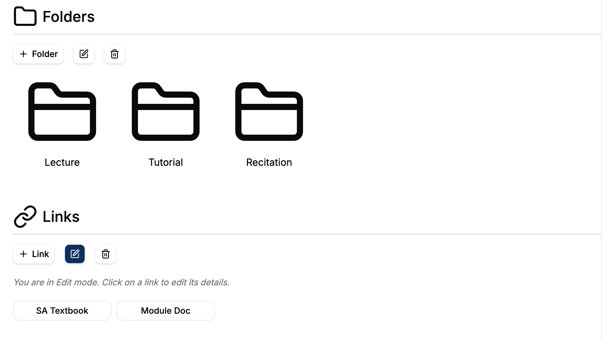
</p>
<p align="center">
  <em>Figure 5.1. Folders and Links Management</em>
</p>

---

#### 3.3.2 Key Functionalities

The Resource Management module provides the following functionalities:

- **External Resource Shortcuts**  
  Users can create links that provide instant access to external learning resources such as Canvas folders, Coursemology, GitHub repositories, Google Drive documents, or other study platforms.

- **Folder Organization**  
  Related resources can be grouped into custom folders, enabling students to organize materials according to topics or learning activities.

- **Resource Management**  
  Both folders and links support complete CRUD (Create, Read, Update, Delete) operations, allowing users to continuously update their course resources throughout the semester.

- **Personalized Resource Structure**  
  Unlike Canvas, users are free to organize learning materials in a way that best matches their own study habits without being restricted by the original course folder hierarchy.

<p align="center">
  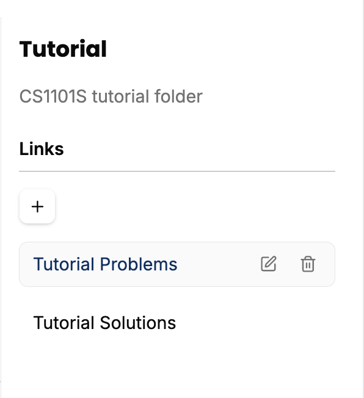
</p>
<p align="center">
  <em>Figure 5.2. Folder Panel</em>
</p>

---

#### 3.3.3 Technical Implementation

The Resource Management module is implemented using two relational database entities: **Folder** and **Link**. Each folder belongs to a specific course, while each link is associated with exactly one folder. This hierarchical relationship allows resources to be managed consistently while supporting flexible organization.

---

##### Loading Course Resources

Whenever a user opens the Course Details page, the frontend retrieves all folders and their corresponding links by sending a request to:

```text
GET /api/folder/all-folders
```

Instead of issuing separate requests for folders and links, the backend performs a **LEFT JOIN** between the `Folder` and `Link` tables before returning the combined dataset. This allows the frontend to reconstruct the folder hierarchy in a single request, reducing unnecessary API calls and improving loading performance.

---

##### The `__general__` Folder

Every course automatically contains a special folder named `__general__`.

Unlike normal folders, this folder is **not displayed** in the user interface. Instead, it serves as the default container for links that are not assigned to any specific topic.

This design offers several advantages:

- Every link always belongs to a folder.
- The same CRUD operations can be reused for all links regardless of whether they are categorized.
- The frontend only needs to maintain a single resource management workflow, simplifying both implementation and future maintenance.

Without this hidden folder, additional logic would be required to separately manage uncategorized links, increasing the complexity of both the frontend and backend.

---

##### Folder and Link Operations

The module exposes a collection of RESTful endpoints that support complete CRUD operations.

**Folder APIs**

- `POST /api/folder/add-folder`
- `PUT /api/folder/update-folder`
- `DELETE /api/folder/delete-folder`

**Link APIs**

- `POST /api/link/create-link`
- `PUT /api/link/update-link`
- `DELETE /api/link/delete-link`

When creating a new link, the frontend specifies the corresponding `folderId` so that the backend can correctly associate the link with its parent folder.

---

##### Master-Detail Resource View

The Resource Management interface follows a **master-detail** layout.

The left panel displays all folders belonging to the current course, while the right panel displays the links contained within the selected folder.

A state variable named `selectedFolder` is maintained on the frontend to keep track of the currently active folder.

- When no folder is selected, `selectedFolder` is automatically initialized to the hidden `__general__` folder.
- Selecting another folder updates `selectedFolder` and refreshes the displayed resource list.
- All CRUD operations performed on links are scoped to the currently selected folder.

This design provides a clean and intuitive navigation experience while minimizing unnecessary page transitions.

<p align="center">
  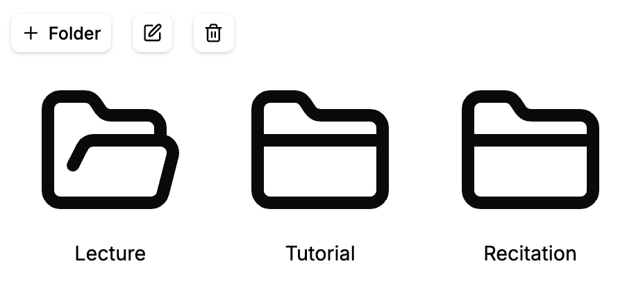
</p>
<p align="center">
  <em>Figure 5.3. Folder Selection</em>
</p>

<p align="center">
  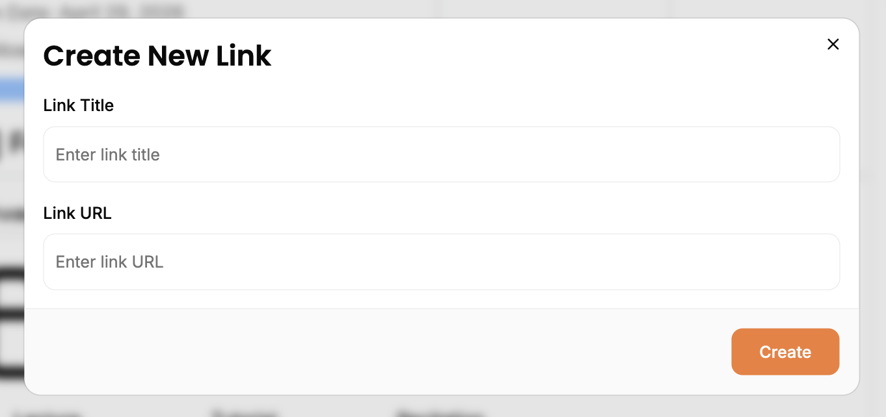
</p>
<p align="center">
  <em>Figure 5.4. Add New Link To Folder Dialog</em>
</p>

### 3.4 Scheduler

#### 3.4.1 Feature Overview

The Scheduler module serves as the central event management system of **NUS Savnac**, allowing students to organize both academic and personal activities throughout the semester. Unlike conventional calendar applications, the scheduler is specifically designed around the **NUS Academic Calendar**, providing a semester-oriented view that aligns with students' academic schedules.

The fundamental unit of the scheduler is an **event**. Every event contains essential information such as its title, occurrence time, venue, and category. Events are visually distinguished using different colors according to their event types, enabling users to quickly identify different kinds of academic activities.

Four event categories are currently supported:

* **Classes** – Lectures, tutorials, laboratory sessions, recitations, and other scheduled teaching activities.
* **Deadlines** – Assignment submissions, project milestones, and coursework deadlines.
* **Exams** – Final examinations, mid-term tests, quizzes, and continual assessments.
* **Others** – Personal events, meetings, workshops, seminars, or any activities outside the predefined categories.

The Scheduler module consists of two calendar views.

The first is the **Course Calendar**, located at the bottom of every Course Details page. It displays only the events belonging to the selected course and provides course-specific event management.

The second is the standalone **Scheduler Page**, which aggregates events across all registered courses together with users' personal events. Besides the semester calendar, the page also provides categorized lists of upcoming events, allowing students to quickly identify approaching deadlines, examinations, and other important activities.

Unlike traditional calendars that organize events using calendar dates, both calendars present events according to the official NUS semester structure, including **Week 1–13**, **Recess Week**, **Reading Week**, and **Examination Week**.

<p align="center">
  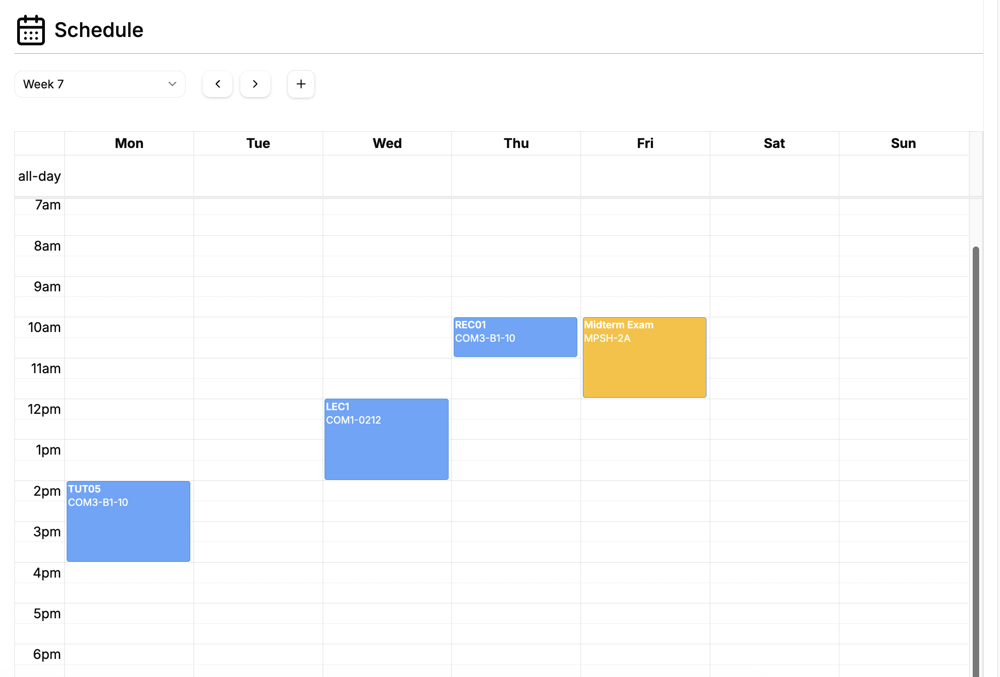
</p>
<p align="center">
  <em>Figure 6.1. Course Scheduler</em>
</p>

<p align="center">
  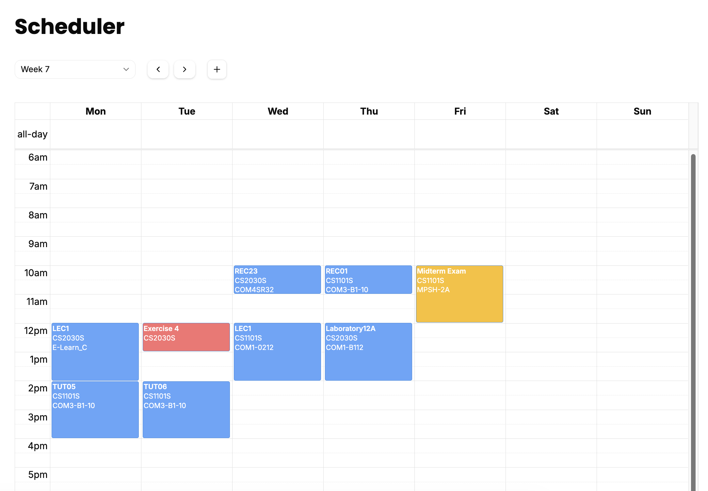
</p>
<p align="center">
  <em>Figure 6.2. Scheduler Page Calendar</em>
</p>

---

#### 3.4.2 Key Functionalities

The Scheduler module provides the following functionalities:

* **Course-specific Calendar**
  Each course contains its own calendar for displaying classes and events related to that module.

* **Semester-based Event Management**
  Users can create academic or personal events by specifying the semester week, weekday, starting time, ending time, and venue.

* **Event Categorization**
  Events are categorized into Classes, Deadlines, Exams, and Others, with each category displayed using a distinct color for easier identification.

* **Event Modification**
  Existing events can be viewed, updated, or removed directly from the calendar interface.

* **Global Scheduler**
  The Scheduler page combines events from all registered courses into a single semester calendar, providing users with a comprehensive overview of their academic commitments.

* **Upcoming Event Summary**
  Upcoming events are grouped by category and displayed in chronological order to improve visibility of approaching deadlines and examinations.

<p align="center">
  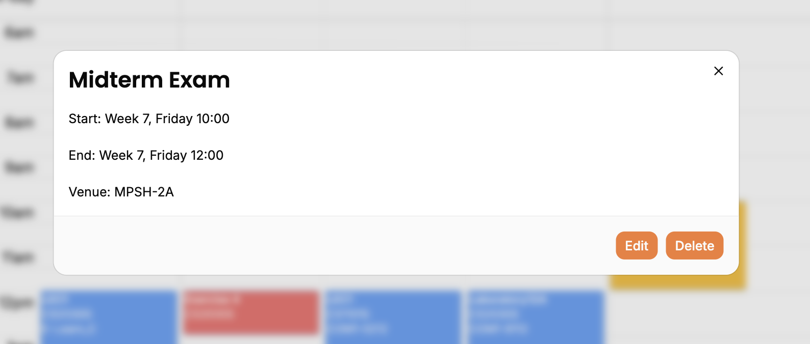
</p>
<p align="center">
  <em>Figure 6.3. Event Info Dialog</em>
</p>

---

#### 3.4.3 Technical Implementation

The Scheduler module is built around a unified **Event** entity that represents both course-related activities and user-created personal events. This common data model allows all calendar views within the application to reuse the same backend services and event manipulation logic.

---

##### Event Data Model

Each event stores the following essential attributes:

| Attribute   | Description                                        |
| ----------- | -------------------------------------------------- |
| `userId`    | Owner of the event                                 |
| `eventType` | Event category (Classes, Deadlines, Exams, Others) |
| `title`     | Display title shown on the calendar                |
| `week`      | NUS Academic Calendar week                         |
| `day`       | Day of the week                                    |
| `startTime` | Event starting time                                |
| `endTime`   | Event ending time                                  |
| `venue`     | Event location (optional)                          |
| `courseId`  | Associated course (optional)                       |

Events associated with a course contain both `userId` and `courseId`, while personal events are linked only to the owning user through `userId`.

The same Event Data Transfer Object (DTO) is reused across all create, update, and retrieval operations, ensuring a consistent API design throughout the scheduler subsystem.

---

##### Course Calendar

When users enter the Course Details page, the frontend automatically retrieves all events belonging to the selected course through:

```text
GET /api/event/get-events-by-course-id
```

The backend queries all events associated with the specified `courseId` before returning them to the frontend.

The Course Calendar is implemented using the **FullCalendar** library. However, the event objects stored in the database differ slightly from the data format required by FullCalendar.

To bridge this difference, each retrieved event is transformed by a helper function named `modifyEvent`, which converts the application's internal event representation into the format expected by the calendar component.

One important transformation involves the time representation. Events are stored using the compact **HHMM** format within the database, while FullCalendar requires timestamps in the **HH:MM:SS** format. Therefore, the helper function reformats the stored time before rendering the events on the calendar.


---

##### Event CRUD Operations

Creating a new event begins with collecting user inputs from the event creation dialog. After validation, the frontend constructs an Event DTO and submits it to:

```text
POST /api/event/add-event
```

Selecting an existing event opens a detailed dialog that allows users to inspect, modify, or remove the selected event.

Updating an event sends the modified DTO to:

```text
PUT /api/event/update-event
```

while deleting an event sends the corresponding `eventId` to:

```text
DELETE /api/event/delete-event
```

After each operation, the calendar is refreshed to immediately reflect the updated event data.

<p align="center">
  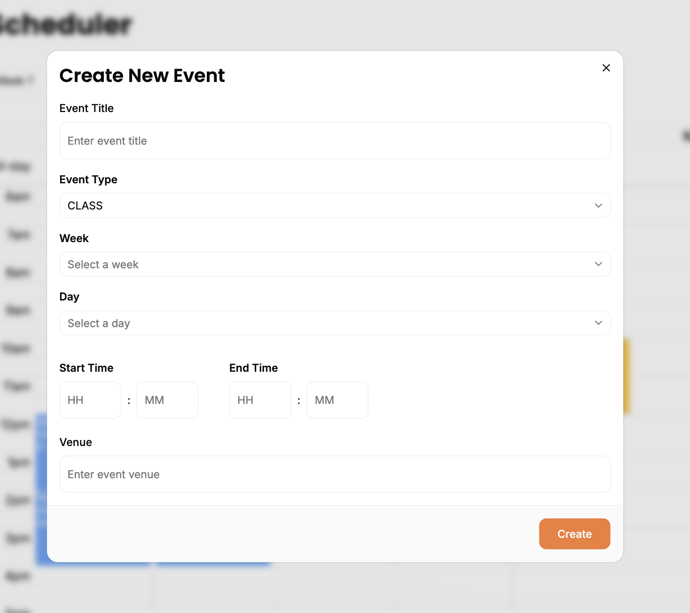
</p>
<p align="center">
  <em>Figure 6.4. Create New Event Dialog</em>
</p>

<p align="center">
  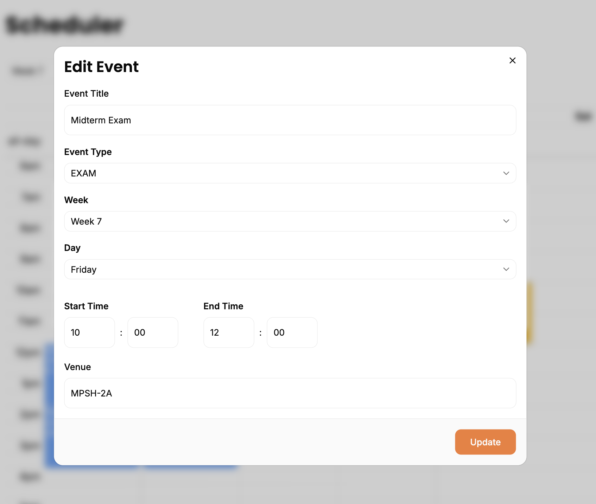
</p>
<p align="center">
  <em>Figure 6.5. Edit Event Dialog</em>
</p>

---

##### Global Scheduler

The Scheduler page shares the same calendar component and event manipulation workflow as the Course Calendar. The primary difference lies in the data retrieval process.

Instead of querying events for a single course, the Scheduler retrieves every event associated with the authenticated user through:

```text
GET /api/event/get-events-by-user-id
```

The returned dataset includes events from all registered courses together with user-created personal events.

After retrieval, the events undergo the same transformation process before being displayed on the calendar. The dataset is then grouped by event category, sorted chronologically, and truncated to the five nearest upcoming events for each category. These categorized summaries provide users with quick access to their most important upcoming academic commitments without requiring them to inspect the entire calendar.

<p align="center">
  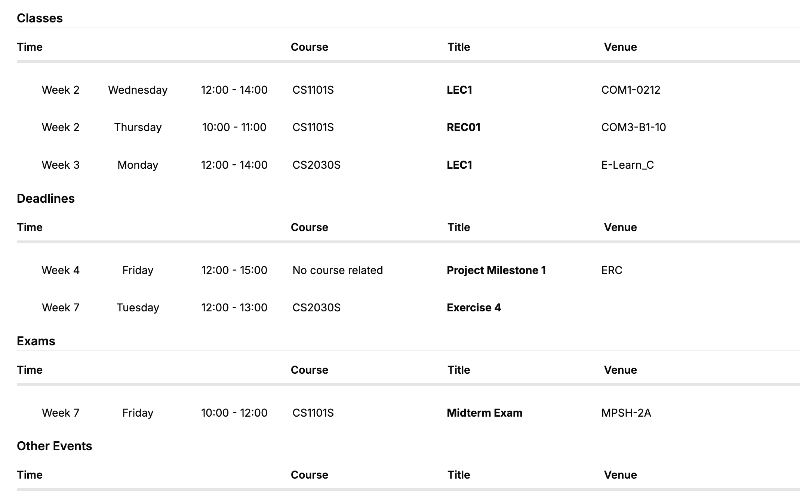
</p>
<p align="center">
  <em>Figure 6.6. Upcoming Event By Categories</em>
</p>


### 3.5 Task Management

#### 3.5.1 Feature Overview

The Task Management module enables students to organize and monitor their academic workload throughout the semester. Instead of relying on external to-do list applications, users can manage course-specific tasks directly within NUS Savnac, allowing task planning to be tightly integrated with course resources and schedules.

Each course maintains its own collection of tasks, allowing students to record assignments, revision plans, tutorial preparation, and other academic activities. To better support different planning horizons, tasks are categorized into two distinct groups:

- **Weekly Tasks** – Recurring tasks that are performed every week, such as completing tutorial worksheets, preparing for laboratory sessions, or reviewing lecture materials.

- **Today Tasks** – Short-term tasks that users intend to complete on the current day, helping them focus on their immediate priorities.

Besides the course-specific task lists, NUS Savnac also provides a dedicated **Task Page** that consolidates tasks from all registered courses into a single interface. This gives students a comprehensive overview of their academic workload without requiring them to navigate between individual course pages.

<p align="center">
  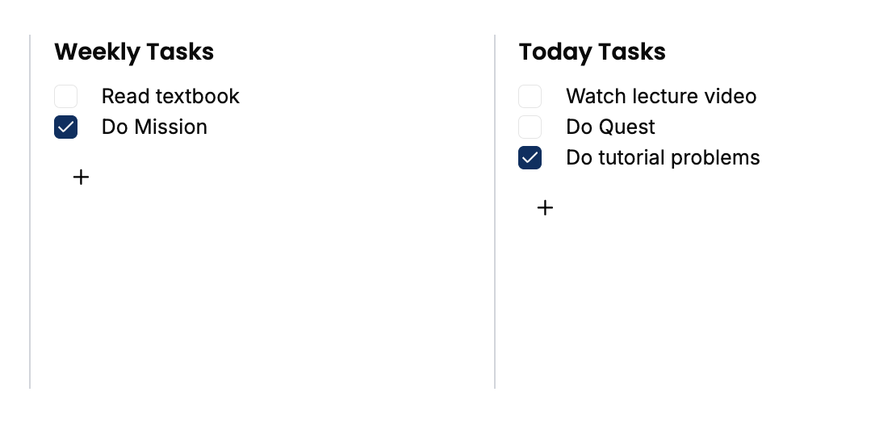
</p>
<p align="center">
  <em>Figure 7.1. Task Management Section</em>
</p>

<p align="center">
  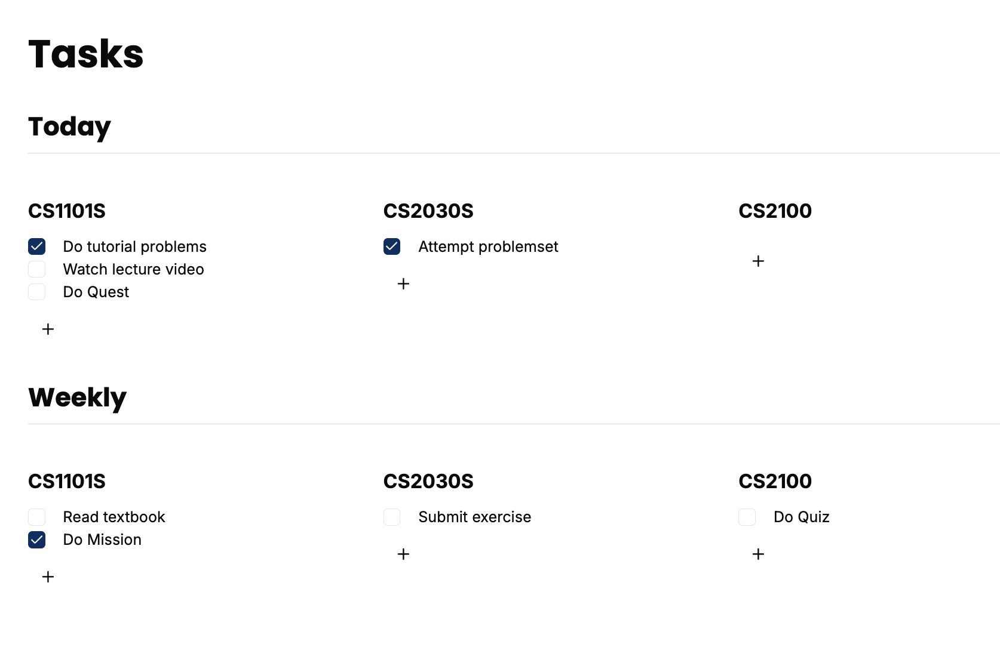
</p>
<p align="center">
  <em>Figure 7.2. Tasks Page</em>
</p>

---

#### 3.5.2 Key Functionalities

The Task Management module provides the following functionalities:

- **Course-specific Task Lists**  
  Users can create and manage tasks independently for each course.

- **Task Categorization**  
  Tasks can be organized as either **Weekly Tasks** or **Today Tasks**, allowing users to distinguish between recurring responsibilities and daily objectives.

- **Task Completion Tracking**  
  Tasks can be marked as completed or incomplete through a single interaction, enabling users to monitor their study progress throughout the semester.

- **Task Management**  
  Users may create, edit, rename, or delete tasks whenever necessary.

- **Centralized Task Overview**  
  The Task Page aggregates tasks across all courses, allowing users to review their overall workload from a single interface.


---

#### 3.5.3 Technical Implementation

The Task Management module is built around a reusable **Task List** component that is shared across both the Course Details page and the standalone Task Page. This component encapsulates all task-related interactions, allowing task creation, modification, completion tracking, and deletion to be implemented once and reused throughout the application.

---

##### Reusable Task List Component

Each course maintains two independent task collections:

- **Weekly Tasks**
- **Today Tasks**

Although both task categories are displayed using the same `TaskList` component, each instance maintains its own state and event handlers independently. Consequently, operations performed on one task list do not affect the other, allowing both lists to coexist within the same page while remaining completely isolated.

This component-based design improves code reusability and simplifies future maintenance.

---

##### Course Task Management

Whenever a user opens a Course Details page, the frontend retrieves all tasks associated with the selected course through:

```text
GET /api/task/get-all-tasks-by-course
```

The returned task collection is separated into **Weekly Tasks** and **Today Tasks** according to each task's category. The two filtered datasets are then rendered using separate instances of the reusable `TaskList` component.

<p align="center">
  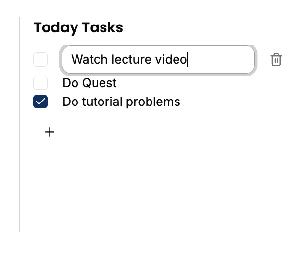
</p>
<p align="center">
  <em>Figure 7.3. Task List Component</em>
</p>

---

##### Task CRUD Operations

The backend exposes a collection of RESTful APIs that support complete task management.

**Task APIs**

- `POST /api/task/create-task`
- `PUT /api/task/update-task`
- `PATCH /api/task/toggle-task`
- `DELETE /api/task/delete-task`

Creating or updating a task begins by constructing a Task DTO from the user's input before sending it to the corresponding backend endpoint.

Task completion is implemented through a lightweight toggle endpoint that updates only the completion status, avoiding unnecessary modification of the remaining task attributes.

After every successful operation, the corresponding Task List is refreshed to ensure that the user interface remains synchronized with the latest database state.

<p align="center">
  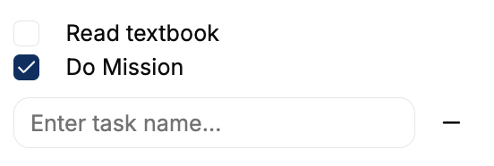
</p>
<p align="center">
  <em>Figure 7.4. Creating New Task</em>
</p>

<p align="center">
  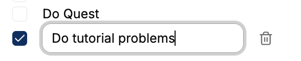
</p>
<p align="center">
  <em>Figure 7.5. Edit a Task</em>
</p>

---

##### Global Task Overview

The standalone **Task Page** provides an aggregated view of tasks from every registered course.

Unlike the Course Details page, which retrieves tasks through the Task module, this page requests data from the Course module using:

```text
GET /api/course/all-courses-with-tasks
```

Instead of returning only task records, the backend performs a **LEFT JOIN** between the `Course` and `Task` tables, allowing each course to be returned together with its associated task collection.

This response structure directly matches the layout required by the frontend, where tasks are grouped under their corresponding courses. As a result, additional grouping logic on the client side is minimized, reducing both processing complexity and unnecessary state transformations.

Each course's task collection is rendered using an independent instance of the reusable `TaskList` component. Since the same component is shared with the Course Details page, all task operations—including creation, editing, completion tracking, and deletion—reuse the same backend APIs and interaction workflow.


### 3.6 Pomodoro Timer

#### 3.6.1 Feature Overview

The Pomodoro Timer is a productivity tool integrated directly into **NUS Savnac** to encourage focused study sessions using the Pomodoro Technique. Rather than requiring students to switch to another website or application, the timer is built directly into the platform so that users can manage their study sessions alongside their academic resources and schedules.

This integration aligns with the overall objective of NUS Savnac—providing a centralized academic workspace where students can access the tools they frequently use without leaving the application.

The current implementation follows the traditional Pomodoro workflow, consisting of alternating **Focus** and **Break** sessions.

<p align="center">
  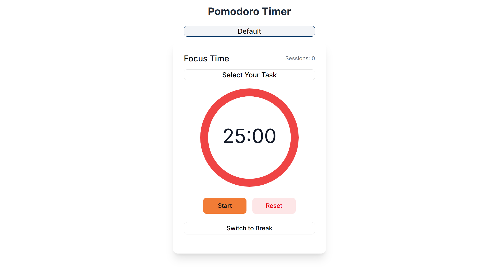
</p>
<p align="center">
  <em>Figure 8.1. Pomodoro Timer Page</em>
</p>

---

#### 3.6.2 Key Functionalities

The Pomodoro module provides the following functionalities:

- **Focus and Break Sessions**  
  The timer alternates automatically between focus and break periods following the Pomodoro Technique.

- **Countdown Timer**  
  The remaining time is updated every second and displayed in a clear **MM:SS** format.

- **Session Tracking**  
  The system records the number of completed focus sessions, allowing users to monitor their study progress.

- **Timer Controls**  
  Users may start, pause, reset, or manually switch between focus and break modes at any time.

- **Automatic Phase Transition**  
  Once a countdown reaches zero, the timer automatically switches to the next study phase without requiring user intervention.

<p align="center">
  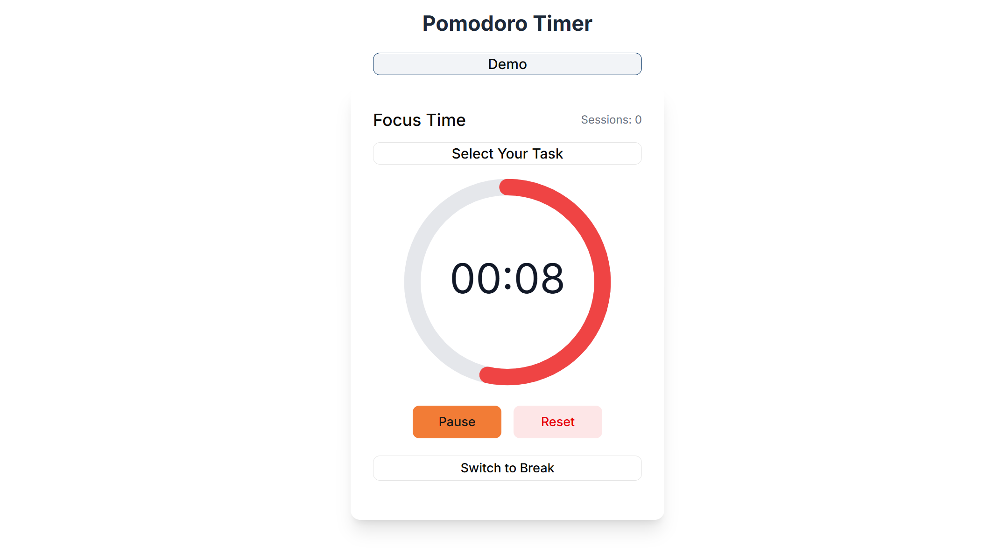
</p>
<p align="center">
  <em>Figure 8.2. Focus Session</em>
</p>

<p align="center">
  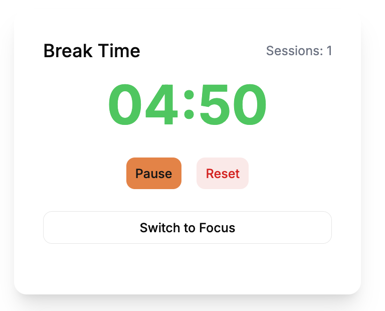
</p>
<p align="center">
  <em>Figure 8.3. Break Session</em>
</p>

---

#### 3.6.3 Technical Implementation

Unlike most modules in NUS Savnac, the Pomodoro Timer operates entirely on the client side and does not require backend communication. All countdown logic is encapsulated within a reusable custom React hook named `useTimer`, while the visual interface is implemented separately through a dedicated `Timer` component.

This separation of concerns allows the timer logic to remain independent from the presentation layer, making future UI modifications possible without affecting the underlying countdown mechanism.

---

##### Timer State Management

The timer maintains its internal state through a single `TimerState` object containing three attributes:

| Attribute | Description |
|----------|-------------|
| `mode` | Current timer phase (`focus` or `break`) |
| `timeLeft` | Remaining time in the current phase (seconds) |
| `sessions` | Number of completed focus sessions |

Rather than maintaining these values as multiple independent state variables, they are intentionally grouped into a single state object.

Since all three values are updated simultaneously inside the same `setInterval` callback, storing them together ensures that every timer tick produces a single, consistent state transition. This design minimizes unnecessary re-renders while preventing stale-state issues that commonly occur when multiple interdependent `useState` variables are updated asynchronously.

A separate boolean state, `isActive`, is maintained outside the `TimerState` object. Unlike the timer state, this variable changes only when users explicitly start or pause the timer, making it independent from the per-second countdown updates.

---

##### Countdown Mechanism

The countdown is implemented using React's `useEffect` hook together with `setInterval`.

Whenever `isActive` becomes `true`, an interval is created that decreases the remaining time by one second at every tick.

When the remaining time reaches zero, the same interval callback automatically performs a phase transition:

- Focus → Break
- Break → Focus

During the transition, the timer resets to the predefined duration of the next phase.

The interval is automatically cleaned up whenever the timer is paused or the component is unmounted, preventing multiple intervals from executing simultaneously and avoiding potential memory leaks.

---

##### Mode Switching

The timer supports both automatic and manual transitions between focus and break sessions.

**Automatic Transition**

When the countdown reaches zero, the timer immediately switches to the next study phase.

**Manual Transition**

Users may manually switch between focus and break sessions by pressing the **Switch Mode** button.

Both transition paths reuse the same state transition logic, ensuring that mode switching behaves consistently regardless of how it is triggered.

The session counter is incremented only when a complete focus session has finished and the timer enters the break phase, providing an accurate measure of completed Pomodoro cycles.

---

##### Timer Controls

The `useTimer` hook exposes three control functions to the user interface:

| Function | Purpose |
|----------|---------|
| `toggleTimer()` | Starts or pauses the timer |
| `resetTimer()` | Restores the timer to its initial state |
| `switchMode()` | Manually switches between focus and break modes |

The `Timer` component consumes these functions to implement the **Start/Pause**, **Reset**, and **Switch Mode** buttons displayed in the user interface.

---

##### Time Formatting

Internally, the remaining time is stored as the total number of seconds to simplify countdown calculations.

Before rendering, the value is converted into the standard **MM:SS** format displayed on the timer interface. Separating the internal representation from the presentation format keeps the countdown logic straightforward while providing users with a familiar and easily readable display.

---

##### Future Improvements

The current implementation uses fixed durations of **25 minutes** for focus sessions and **5 minutes** for break sessions.

A future enhancement will allow users to configure these durations according to their personal preferences. This feature will require backend support for persisting timer settings in the database and restoring them whenever users access the Pomodoro module.

## 4. User Guide

### 4.1. Account
#### Login
1. Enter your registered email
2. Enter your registered password
3. Click <kbd>Login</kbd> to login to your account
4. Click on **Create one** to navigate to **Register Page** if you don't have an account

<p align="center">
  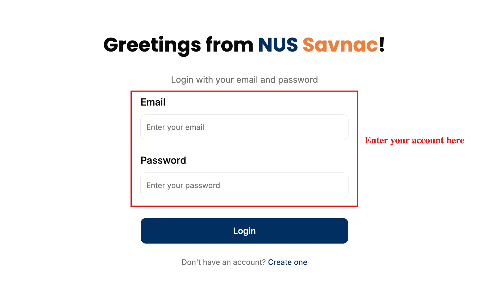
</p>
<p align="center">
  <em>Figure 9.1. Login Page</em>
</p>

---

#### Create new account
1. Enter your display name
2. Enter your NUS email
3. Enter your password. There are restrictions on the password that you need to satisfy
4. Click <kbd>Register</kbd> and a verification code will be sent to your email
5. Enter the verification code to verify your new account

<p align="center">
  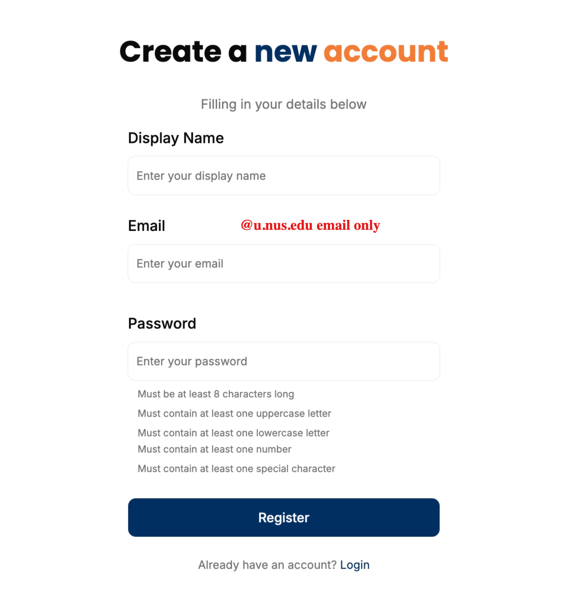
</p>
<p align="center">
  <em>Figure 9.2. Register Page</em>
</p>


### 4.2. Dashboard

#### Add a Course
1. Click on <kbd>+ Course</kbd> and select **NUS Course** to open the **Add NUS Course** dialog
<p align="center">
  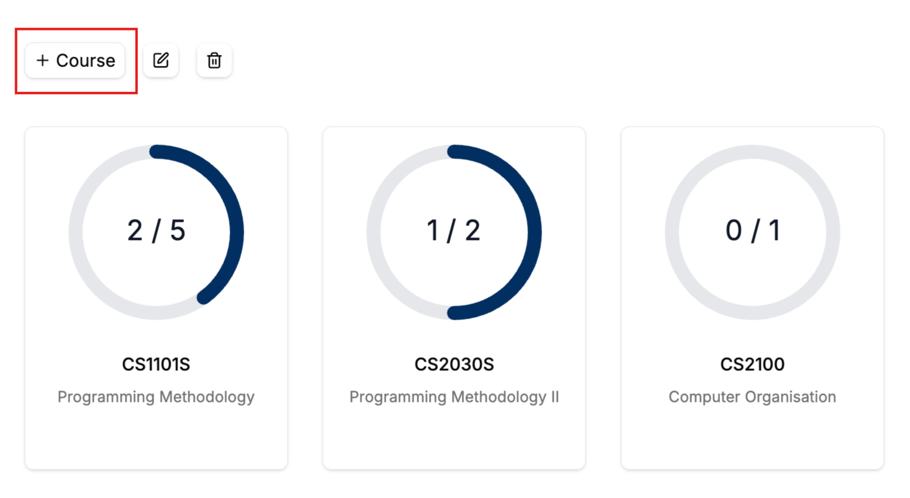
</p>
<p align="center">
  <em>Figure 9.3. Add Course Button</em>
</p>

2. Search for the course by its module code
<p align="center">
  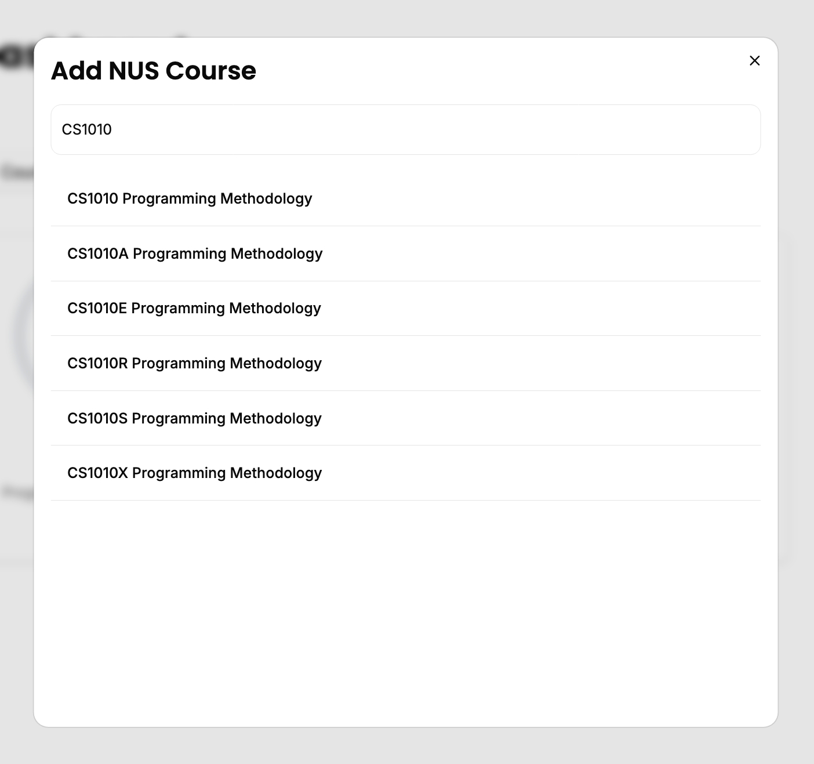
</p>
<p align="center">
  <em>Figure 9.4. Searching for a Course</em>
</p>

3. Click on the course to add it to dashboard
---

#### Delete a Course
1. Click on <kbd>🗑️</kbd> to switch to **DELETE** mode
<p align="center">
  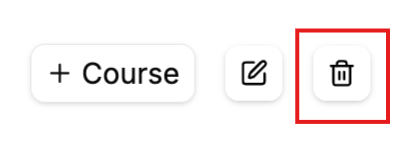
</p>
<p align="center">
  <em>Figure 9.5. DELETE Mode button</em>
</p>

2. Select the course you want to delete
<p align="center">
  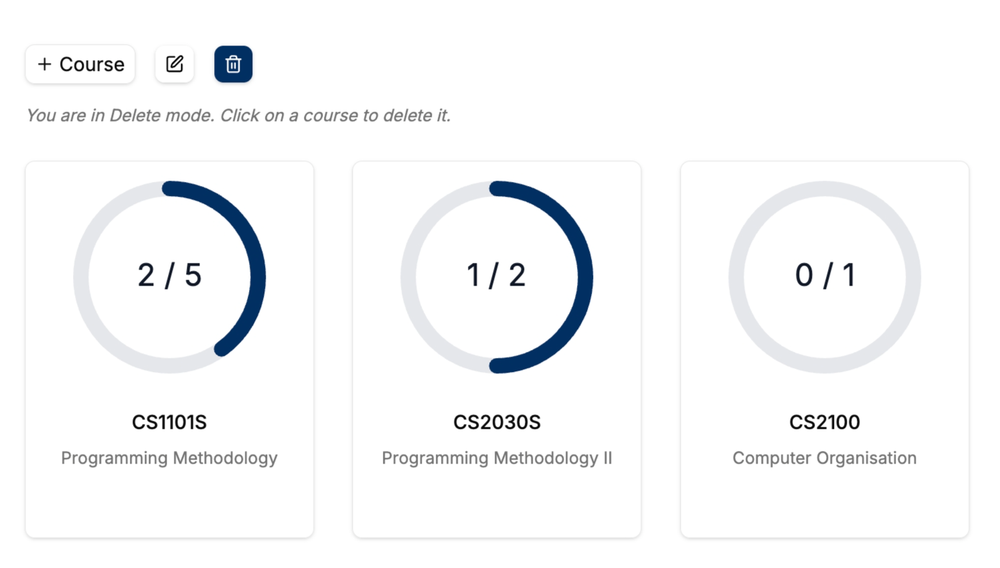
</p>
<p align="center">
  <em>Figure 9.6. Courses in DELETE mode</em>
</p>


3. A dialog will pop up. Click <kbd>Delete</kbd> to delete the course
<p align="center">
  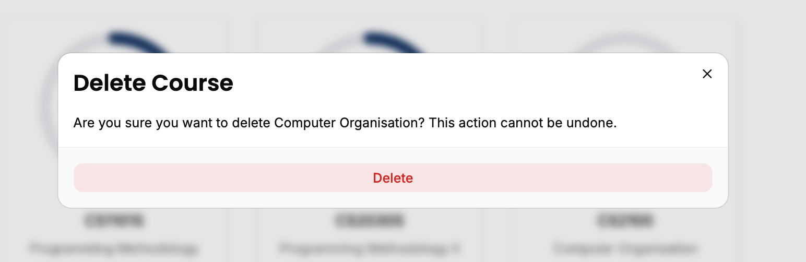
</p>
<p align="center">
  <em>Figure 9.7. Delete Course Dialog</em>
</p>

### 4.3. Resources Management

#### Create a Folder
1. Click on <kbd>+ Folder</kbd> to open the **Create New Folder** dialog
<p align="center">
  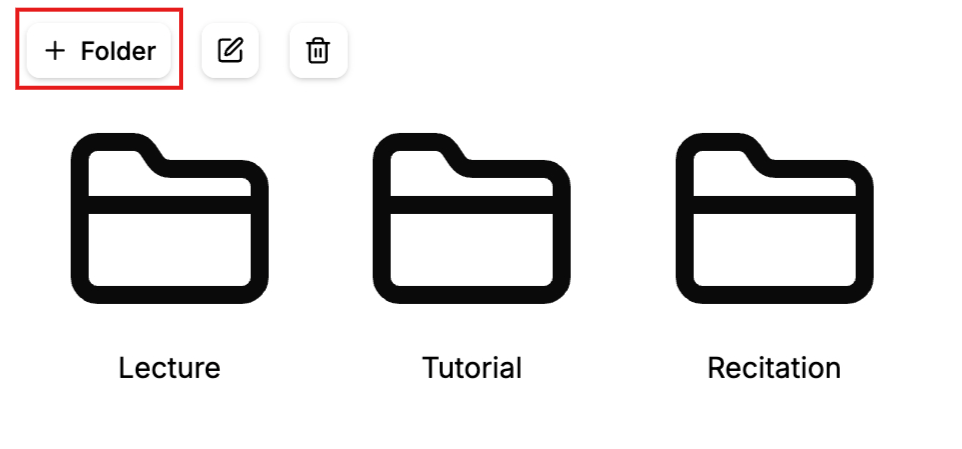
</p>
<p align="center">
  <em>Figure 9.8. Add Folder Button</em>
</p>

2. Enter the **Folder Name** and **Folder Description**
<p align="center">
  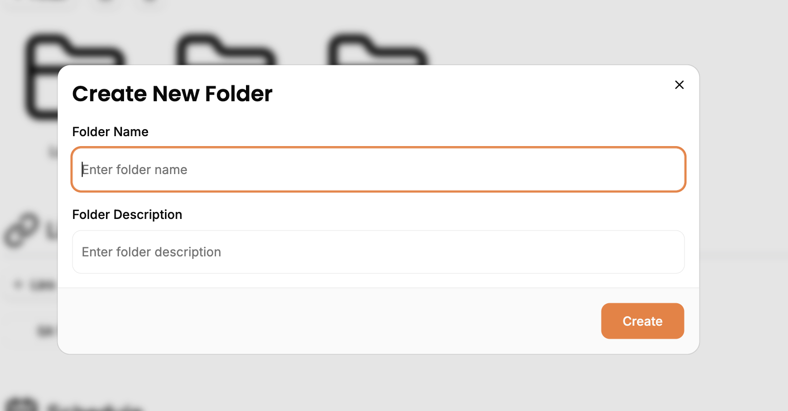
</p>
<p align="center">
  <em>Figure 9.9. Create New Folder Dialog</em>
</p>

3. Click <kbd>Create</kbd> to create the folder
---
#### Create a Link
To create a new link in the **Links** section:
1. Click <kbd>+ Link</kbd> to open the **Create New Link** dialog
<p align="center">
  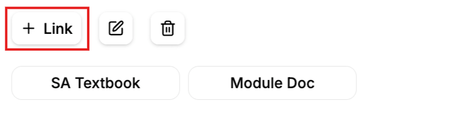
</p>
<p align="center">
  <em>Figure 9.10. Create Link button</em>
</p>

2. Enter the **Link Title** and **Link URL**
<p align="center">
  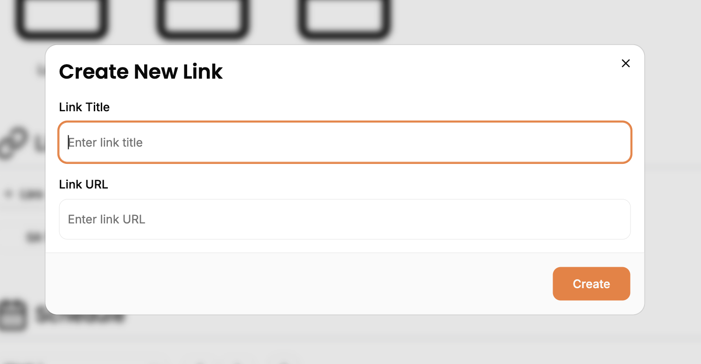
</p>
<p align="center">
  <em>Figure 9.11. Create New Link Dialog</em>
</p>

3. Click <kbd>Create</kbd> to create the link

To create a new link in a folder:
1. Select the folder that you want to add a new link
2. In the right panel, click on <kbd>+</kbd> to open the **Create New Link** dialog
<p align="center">
  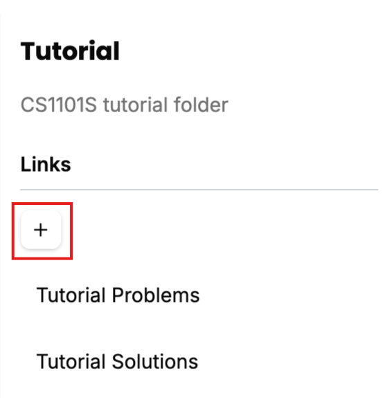
</p>
<p align="center">
  <em>Figure 9.12. Create Link Button</em>
</p>

3. Enter the **Link Title** and **Link URL**
4. Click <kbd>Create</kbd> to create the link
---
#### Manage Folders and Links
To edit or delete a folder:
1. Click on <kbd>✏️</kbd> or <kbd>🗑️</kbd> to switch the **Folders** section to **EDIT** or **DELETE** mode

<p align="center">
  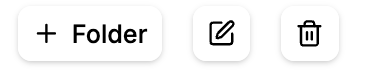
</p>
<p align="center">
  <em>Figure 9.13. EDIT and DELETE mode buttons</em>
</p>

2. Select the folder that you want to edit or delete
3. In **EDIT** mode, the **Edit Folder** dialog will pop up. Make changes to the **folder name** or **folder description** and click on <kbd>Update</kbd>

<p align="center">
  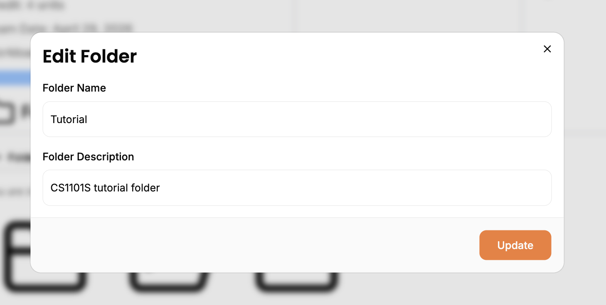
</p>
<p align="center">
  <em>Figure 9.14. Edit Folder Dialog</em>
</p>

4. In **DELETE** mode, a dialog will pop up. Click on <kbd>Delete</kbd> to delete the folder

<p align="center">
  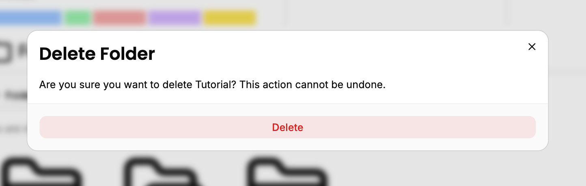
</p>
<p align="center">
  <em>Figure 9.15. Delete Folder Dialog</em>
</p>

To edit or delete a link in a folder:
1. Hover your mouse on the link, and click on <kbd>✏️</kbd> or <kbd>🗑️</kbd> icons to edit or delete it

<p align="center">
  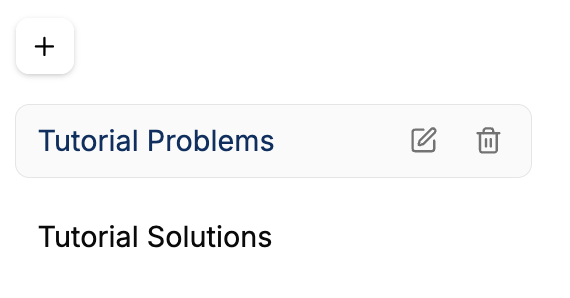
</p>
<p align="center">
  <em>Figure 9.16. Link When Hovered</em>
</p>

2. When clicking on <kbd>✏️</kbd>, the **Edit Link** dialog will pop up. Make changes to the **title** and **URL** of the link and click <kbd>Update</kbd>

<p align="center">
  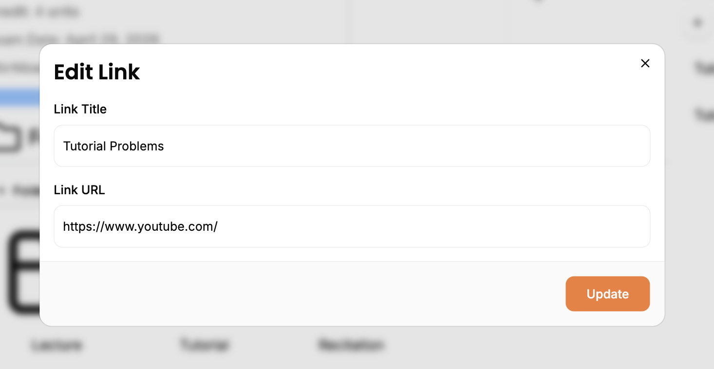
</p>
<p align="center">
  <em>Figure 9.17. Edit Link Dialog</em>
</p>

3. When clicking on <kbd>🗑️</kbd>, a dialog will pop up. Click <kbd>Delete</kbd> to delete the link.

<p align="center">
  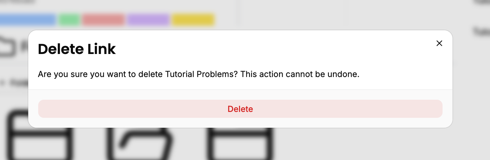
</p>
<p align="center">
  <em>Figure 9.18. Delete Link Dialog</em>
</p>

### 4.4. Scheduler
#### Add an Event
To add a class of the course:
1. Click on <kbd>+</kbd> and select **NUS Class**
<p align="center">
  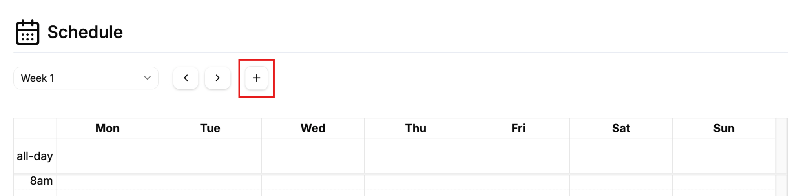
</p>
<p align="center">
  <em>Figure 9.19. Add Event Button</em>
</p>

2. The **Add NUS Class** dialog will pop up. Click on the class to add it
<p align="center">
  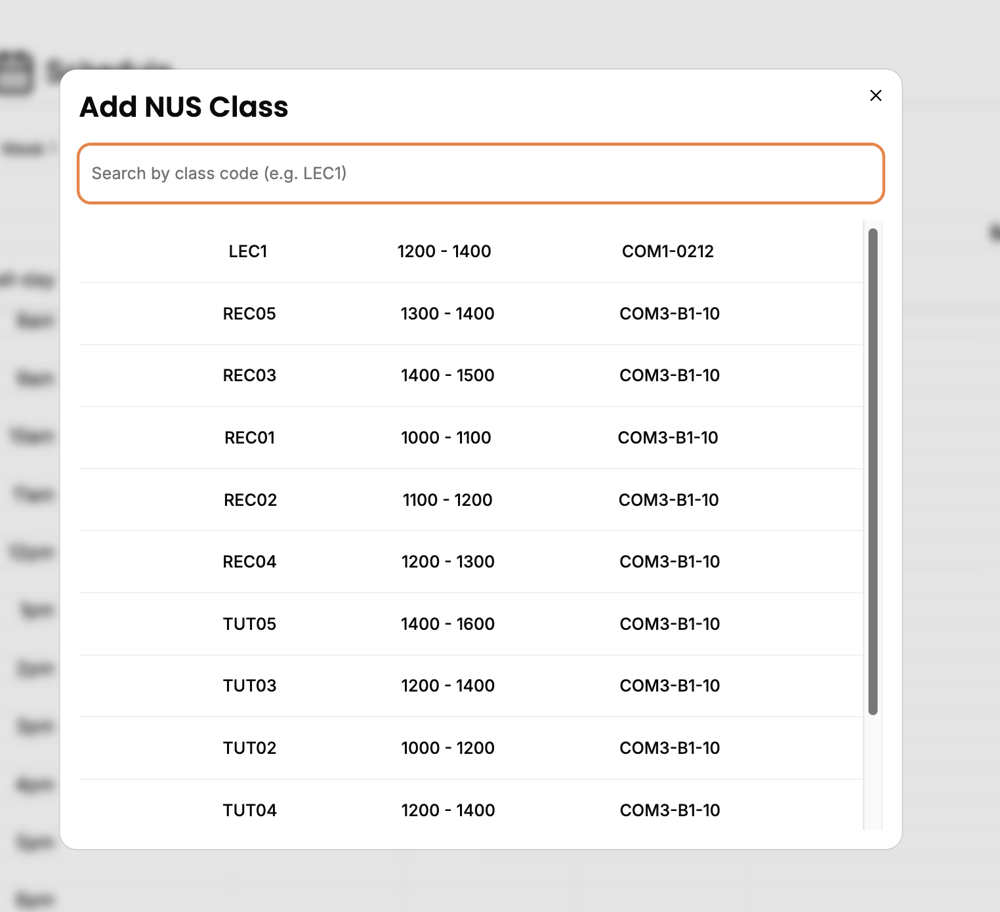
</p>
<p align="center">
  <em>Figure 9.20. Add NUS Class Dialog</em>
</p>

To add a custom event:
1. Click on <kbd>+</kbd> and select **Custom Event**
2. The **Create New Event** dialog will pop up. Fill in the information for the new event
<p align="center">
  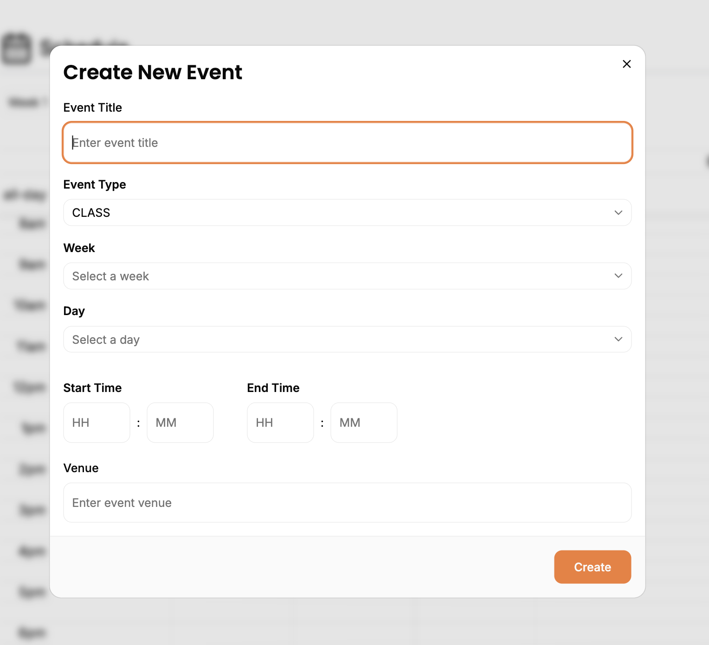
</p>
<p align="center">
  <em>Figure 9.21. Create New Event Dialog</em>
</p> 

3. Click on <kbd>Create</kbd> to create the event
---
#### Edit or Delete an Event
1. On the calendar, click on the event that you want to edit or delete
2. The **Event Info** dialog will pop up. Click on <kbd>Edit</kbd> or <kbd>Delete</kbd> to edit or delete the event
<p align="center">
  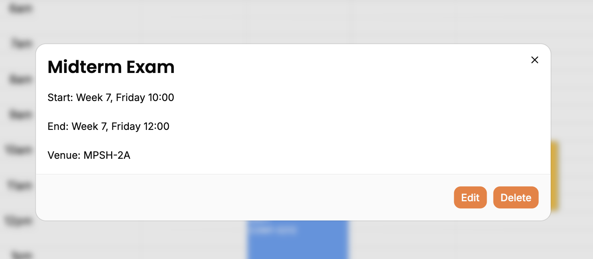
</p>
<p align="center">
  <em>Figure 9.22. Event Info Dialog</em>
</p> 

3. When clicking on <kbd>Edit</kbd>, the **Edit Event** dialog will pop up. Make changes to the event details and click on <kbd>Update</kbd> to save changes
<p align="center">
  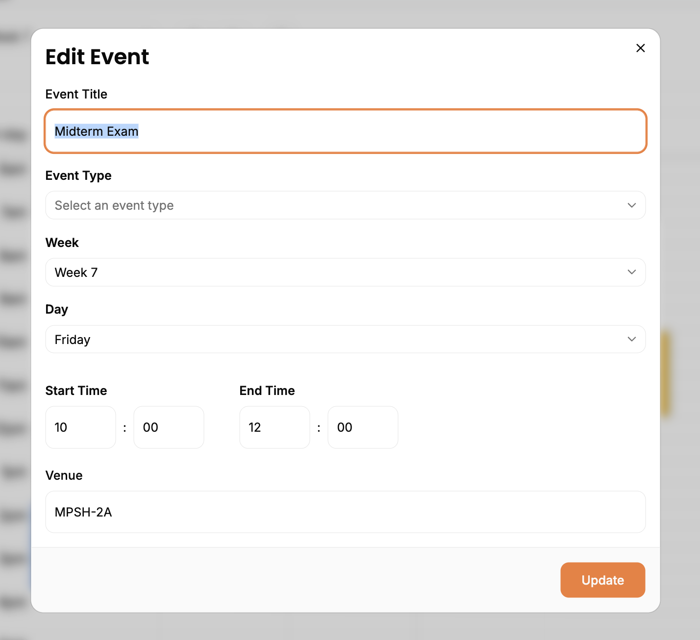
</p>
<p align="center">
  <em>Figure 9.23. Edit Event Dialog</em>
</p> 

4. When clicking on <kbd>Delete</kbd>, a dialog will pop up. Click on <kbd>Delete</kbd> to delete the event
<p align="center">
  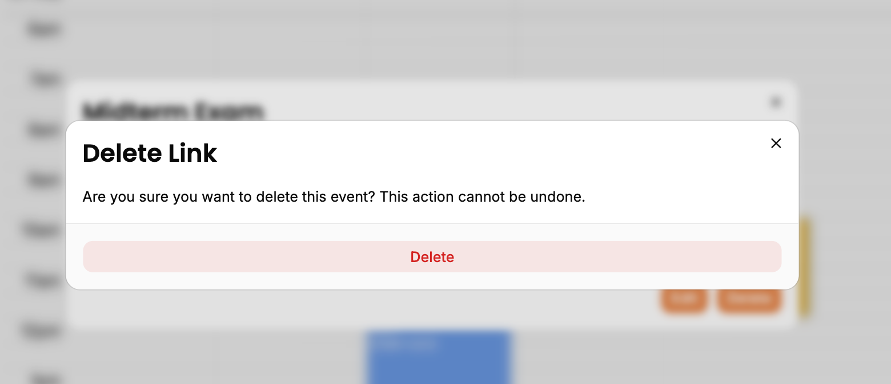
</p>
<p align="center">
  <em>Figure 9.24. Delete Event Dialog</em>
</p> 

---
#### Navigating Between Weeks
1. Use the navigation tool to navigate between the weeks of the semester
<p align="center">
  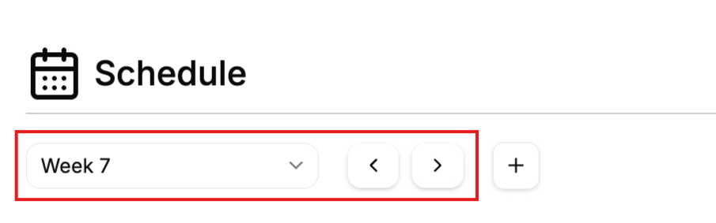
</p>
<p align="center">
  <em>Figure 9.25. Week Navigation Toolbar</em>
</p> 

2. Click on the dropdown list and select the week that you want to display
3. Click on <kbd><</kbd> to move to the previous week
4. Click on <kbd>></kbd> to move to the next week

---
### 4.5. Task Management
#### Add a task
1. Click on <kbd>+</kbd> at the bottom of the task list
<p align="center">
  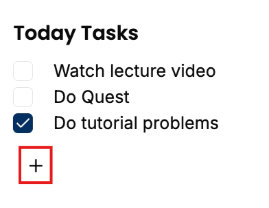
</p>
<p align="center">
  <em>Figure 9.26. Add New Task Button</em>
</p> 
2. Enter the task name
<p align="center">
  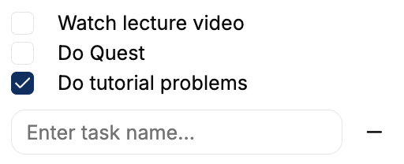
</p>
<p align="center">
  <em>Figure 9.27. Entering Task Name</em>
</p> 

3. Press **Enter** key to add the new task to the list

---
#### Manage Tasks
To edit or delete a task:
1. Click on the task that you want to edit or delete
2. Changing the task name and press **Enter** key will update the task name
3. Click on <kbd>🗑️</kbd> will the delete the task

<p align="center">
  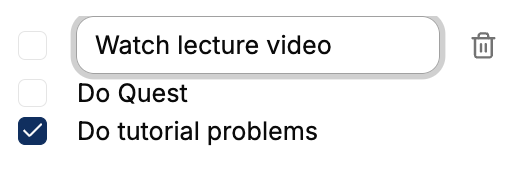
</p>
<p align="center">
  <em>Figure 9.27. Edit or Delete a Task</em>
</p> 

To mark a task as completed:
1. Click on the empty checkbox to mark the task as completed
2. Click on the checked checkbox to mark the task uncompleted

### 4.6. Pomodoro
#### Using the Timer
1. Click on <kbd>Start</kbd> to start the session. The Timer will be in **Focus** mode and start counting down
2. To pause the Timer, click on <kbd>Pause</kbd>
3. To resume the Timer, click on <kbd>Start</kbd> again
4. To reset the Timer and sessions counter, click on <kbd>Reset</kbd>
<p align="center">
  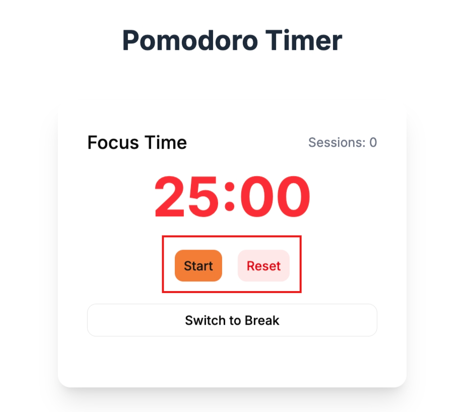
</p>
<p align="center">
  <em>Figure 9.28. Timer Controller</em>
</p> 

---
#### Switching Between Focus and Break Sessions
1. When in **Focus** session, click on <kbd>Switch to Break</kbd> will instantly switch the timer to **Break** session
2. When in **Break** session, click on <kbd>Switch to Focus</kbd> will instantly switch the timer to **Focus** session

<p align="center">
  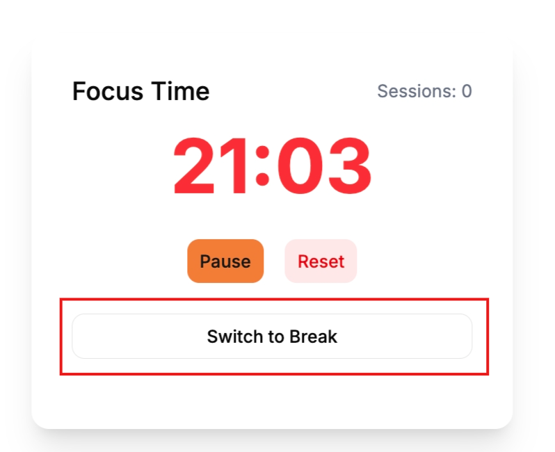
</p>
<p align="center">
  <em>Figure 9.27. Switch to Break session</em>
</p> 

# 5. Testing

To improve the reliability and maintainability of **NUS Savnac**, multiple levels of software testing were carried out throughout the development process. Rather than relying solely on manual verification, the project adopts a layered testing strategy to validate different parts of the system independently. Three complementary testing approaches are employed:

* **Integration Testing** verifies the correctness of backend REST APIs and their interactions with the database.
* **Component Testing** ensures that individual React components behave correctly when rendered in isolation.
* **End-to-End (E2E) Testing** validates complete user workflows across both the frontend and backend, simulating real user interactions with the system.

Together, these testing approaches provide confidence that individual components function correctly, APIs behave as expected, and the overall application operates reliably from the user's perspective.

---

## 5.1. Integration Testing

Backend integration tests are implemented using **Supertest** together with **Jest**. These tests verify the behavior of REST API endpoints by sending HTTP requests to the backend application and validating the returned responses.

The integration tests cover the communication between controllers, services, and the database layer, ensuring that API endpoints correctly process requests and return appropriate HTTP status codes and response bodies. Both successful scenarios and error cases are included, such as invalid requests, missing resources, and failed validations.

This testing approach ensures that the backend behaves consistently when accessed by the frontend application.

---

## 5.2. Component Testing

Frontend component testing is implemented using **React Testing Library**. Instead of testing the application as a whole, component tests focus on verifying the behavior of individual React components in isolation.

The tests validate that components render the expected user interface, respond correctly to user interactions, update their states appropriately, and display the correct information according to the provided props and application state.

By testing components independently, UI-related regressions can be detected early while keeping the tests fast and maintainable.

---

## 5.3. End-to-End Testing

End-to-End (E2E) testing is implemented using **Playwright** to simulate real user interactions with the application.

Unlike integration and component testing, E2E tests validate complete user workflows that span both the frontend and backend. Typical scenarios include user authentication, course management, resource management, scheduler operations, task management, and other major features available within the application.

Each test interacts with the application through the browser in the same manner as an actual user, ensuring that frontend components, backend APIs, database operations, and routing work together correctly. This provides an additional level of confidence that the system functions as expected under real usage conditions.
