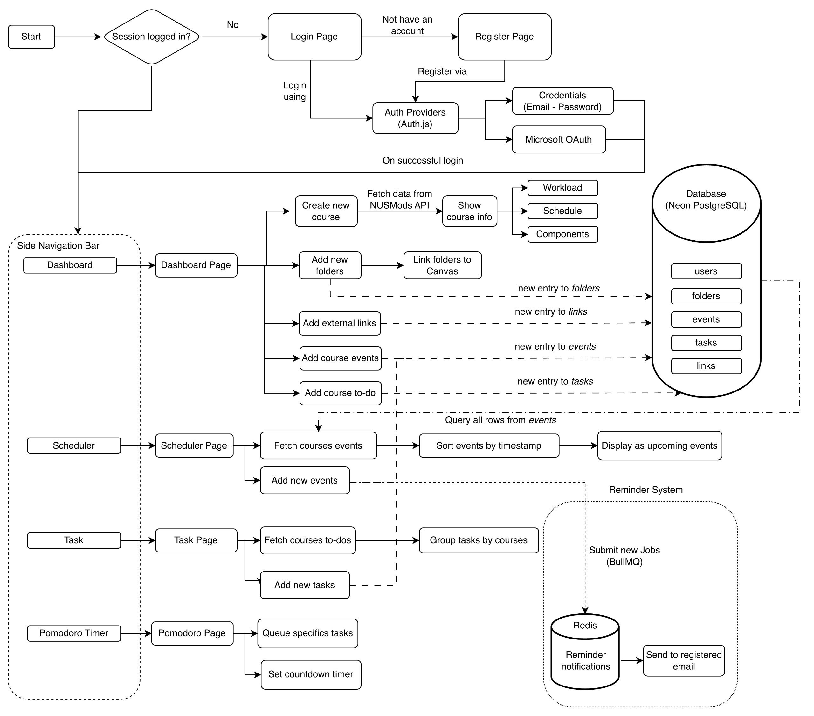
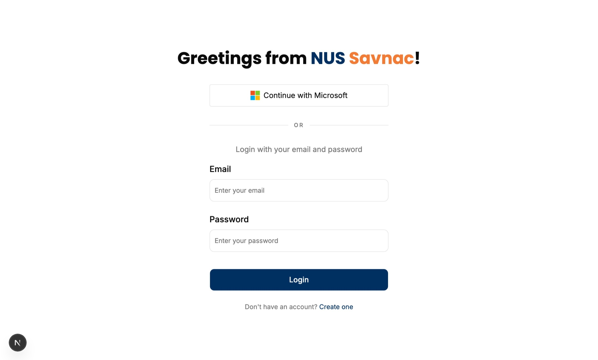
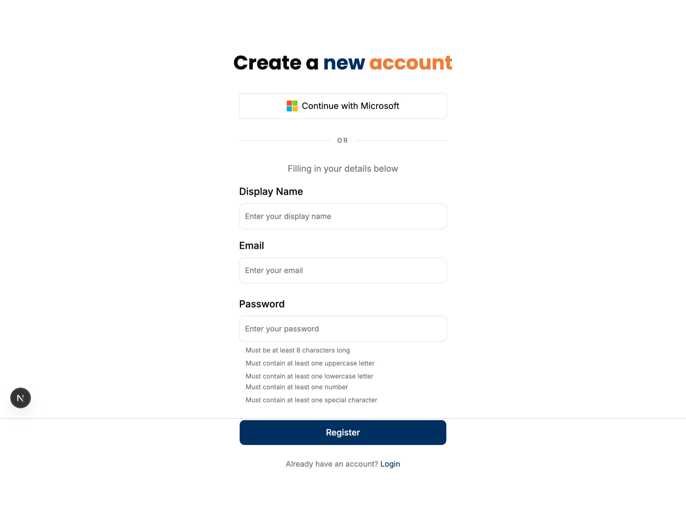

# NUS SAVNAC DOCUMENTATION

  

*Team name*
**SchedWarden**

*Project name*
**NUS Savnac**

*Production*
https://nus-savnac.vercel.app/

## 1. Introduction

### 1.1 Motivation

The current learning ecosystem at the **National University of Singapore (NUS)** relies heavily on platforms such as ***Canvas*** and external systems such as ***Coursemology***. While these platforms provide essential functionality for course administration and content delivery, their usage often varies significantly across modules due to differences in teaching styles and course requirements. As a result, students are frequently required to navigate multiple platforms in order to access learning materials, submit assignments, complete quizzes, and track academic progress.

Furthermore, ***Canvas*** does not provide a centralized view of a student's overall academic workload. Important responsibilities such as tutorial preparation, revision sessions, project milestones, and self-directed study are often managed separately by students. This challenge is especially apparent for freshmen, who are still adapting to the increased independence and workload associated with university education.

Another limitation lies in the organization of learning resources. Although Canvas provides a *Files* section for course materials, resources are often stored within deeply nested folder structures. Students may need to repeatedly navigate through multiple layers of folders to access frequently used documents, resulting in an inefficient and repetitive workflow.

In addition, Canvas lacks integrated tools for long-term study planning, task management, and productivity tracking. Students are therefore required to rely on external applications such as calendars, task managers, and productivity tools to organize their academic commitments. The use of multiple disconnected systems creates fragmented workflows and increases the cognitive effort required to manage university life effectively.

These limitations motivated the development of **NUS Savnac**, a centralized academic management platform that aims to streamline academic organization, improve productivity, and provide students with a more unified learning experience.

### 1.2 Project Overview

***NUS Savnac*** is an academic management platform designed specifically for students of the **National University of Singapore**. The platform aims to centralize course information, study resources, schedules, and task management tools within a single application, reducing the need for students to switch between multiple systems throughout their daily academic activities.

The name *Savnac* is derived from the reverse spelling of *Canvas*, reflecting the project's goal of complementing and extending the functionality provided by the university's primary learning management system. Rather than replacing Canvas, NUS Savnac acts as a productivity-focused companion platform that helps students organize their academic responsibilities more efficiently.

The platform consists of four core features:

* **Dashboard** – Serves as the central hub of the application. Students can add NUS modules, organize course-specific resources, create custom folders containing external links, and access module information retrieved from NUSMods. The dashboard also provides a consolidated view of upcoming academic activities and course-related tasks.

* **Scheduler** – A semester-based scheduling system aligned with the NUS Academic Calendar. The scheduler aggregates module schedules and user-created events into a unified timeline, allowing students to plan their study routines and monitor upcoming commitments.

* **Task Management** – A centralized task-tracking interface that consolidates assignments, deadlines, and personal tasks across all registered courses. Tasks are organized in a structured manner to help students monitor their academic progress and maintain productivity throughout the semester.

* **Reminder System** – An automated notification system that monitors upcoming deadlines and events. Users can configure reminder intervals according to their preferences, and notifications are delivered through email to ensure important deadlines are not overlooked.

Beyond its core functionality, NUS Savnac also incorporates several productivity-enhancing features:

* **Pomodoro Timer** – Enables users to create focused study sessions by allocating time blocks to specific tasks. This feature encourages effective time management and minimizes distractions during study periods.

* **AI Advising System** – Assists students in planning their schedules and academic workload by generating personalized recommendations for study routines and task prioritization.

* **Voice Command System** – Provides a collection of predefined voice commands that allow users to interact with selected system functionalities through voice-based input, improving accessibility and convenience.

By combining academic management, scheduling, productivity tools, and intelligent assistance within a single platform, NUS Savnac aims to reduce administrative overhead and allow students to focus more effectively on learning.

### 1.3 Expectations

NUS Savnac is designed to serve as a comprehensive academic companion for NUS students. The project aims to improve the way students organize, manage, and track their academic responsibilities throughout the semester.

The system is expected to:

* Provide a centralized platform for managing courses, schedules, tasks, and study resources.
* Reduce the effort required to navigate between multiple academic systems and applications.
* Improve visibility of upcoming deadlines, events, and academic commitments.
* Encourage productive study habits through integrated productivity tools such as the Pomodoro Timer and Reminder System.
* Assist students in planning and prioritizing their workload through intelligent scheduling recommendations.
* Minimize the likelihood of missed deadlines and overlooked academic responsibilities.
* Deliver a more organized and efficient academic experience for students throughout their university journey.

Ultimately, the project seeks to reduce cognitive load associated with academic management and enable students to dedicate more time and attention to meaningful learning activities.

## 2. System Design
### 2.1. Overall Architecture
The overall architecture of the system is shown below.

  

  <em>Figure 1. Overall System Architecture</em>

The NUS Savnac system consists of four main components: the frontend application, backend services, database, and background job processing system. Users interact with the platform through a Next.js frontend, which communicates with backend services and external data sources such as the NUSMods API.

User data, tasks, events, folders, and course information are stored in a PostgreSQL database hosted on Neon. To support automated reminders, BullMQ and Redis are used to process background jobs and deliver scheduled email notifications. This architecture provides a clear separation between user interaction, data management, and asynchronous processing, ensuring maintainability and scalability.

### 2.2. Technology Stack

#### Frontend

* ***Next.js***
  A React-based framework used to build the frontend application. Next.js was chosen for its modern routing system, server-side rendering capabilities, and seamless integration with the React ecosystem.

* ***Tailwind CSS***
  A utility-first CSS framework used for styling the application. Tailwind CSS enables rapid UI development while maintaining a consistent and scalable design system.

* ***shadcn/ui***
  A collection of reusable and customizable UI components built on top of Radix UI and Tailwind CSS. It was selected to accelerate development while maintaining full control over component styling and behavior.

* ***Framer Motion***
  An animation library used to create smooth transitions and interactive user experiences. Framer Motion helps improve the overall usability and visual appeal of the application.

#### Backend

* ***NestJS***
  A progressive Node.js framework used to build the backend services. NestJS was chosen for its modular architecture, strong TypeScript support, and maintainable project structure.

* ***NUSMods API***
  An external API that provides module, timetable, and academic information from NUS. It serves as the primary source of module-related data within the application.

#### Database

* ***PostgreSQL***
  A relational database management system used for persistent data storage. PostgreSQL was selected for its reliability, performance, and strong support for complex relational data.

* ***Prisma***
  A type-safe ORM used to interact with the PostgreSQL database. Prisma simplifies database operations while improving developer productivity and reducing the likelihood of runtime errors.

#### Background Jobs

* ***BullMQ***
  A Redis-based job queue used for scheduling and processing asynchronous tasks. BullMQ enables the application to handle background operations without affecting user-facing performance.

* ***Redis***
  An in-memory data store used by BullMQ for queue management and job persistence. Redis provides high performance and low latency for background task processing.

#### Authentication

* ***Auth.js***
  An authentication framework used to manage user authentication and session handling. Auth.js was chosen for its seamless integration with Next.js and support for multiple authentication providers.

  * *Credentials (Username and Password)*
    Provides traditional account-based authentication, allowing users to securely register and log in using their email and password.

  * *Microsoft OAuth*
    Enables users to authenticate using their Microsoft accounts, providing a convenient and secure single sign-on experience.

#### Deployment

* ***Vercel***
  The hosting platform used for deploying the frontend application. Vercel offers optimized support for Next.js applications and provides a streamlined deployment workflow.

* ***Railway***
  A cloud platform used to host backend services and supporting infrastructure. Railway simplifies service deployment and environment management.

* ***Neon***
  A serverless PostgreSQL platform used to host the application's database. Neon was selected for its scalability, ease of management, and seamless integration with modern cloud workflows.

#### Developer Tools

* ***Git/GitHub***
  Used for version control and collaborative development. Git and GitHub facilitate code management, feature branching, and team collaboration throughout the project lifecycle.

* ***Jest***
  A testing framework used for writing and executing unit tests. Jest helps ensure the correctness and reliability of application logic.

* ***Supertest***
  A library used for API and integration testing. Supertest allows backend endpoints to be tested in an automated and reproducible manner.

### 2.4. Authentication design
The design for authentication system is shown as below.

  

  <em>Figure 2. Authentication System Design</em>

The authentication system is built around **Auth.js** and supports both *credentials-based authentication* and *Microsoft OAuth*. Authentication responsibilities are separated across the frontend, Auth.js provider layer, backend services, and database layer to improve maintainability and security.

For credentials authentication, user information is validated and verified against encrypted passwords stored in the database before a session is created. For Microsoft OAuth, user identity is delegated to Microsoft's authentication service, and new user records are automatically created when necessary. This design provides a flexible authentication architecture while maintaining a consistent session management workflow.

## 3. Feature Implementation
### 3.1. User Authentication
#### 3.1.1. Feature Overview
The User Authentication feature enables users to securely access and manage their accounts within ***NUS Savnac***. The system supports both traditional credentials-based authentication and Microsoft OAuth, providing users with multiple sign-in options.
- The credentials-based authentication provides users with easy access method to *NUS Savnac* by just entering email and password.
- Microsoft OAuth method allows NUS students to login with their NUS Outlook account.

Authentication is required before accessing protected features such as course management dashboard, scheduling, and task tracking.

  

  <em>Figure 3.1. Login Page</em>

  

  <em>Figure 3.2. Register Page</em>

#### 3.1.2. Key Functionalities
- User registration by email and password
- User login using emal and password
- Automatic account registration for first-time Microsoft OAuth users
- User login using Microsoft OAuth
- Secure session management by Auth.js

#### 3.1.3. Technical Implementation
##### Credentials-Based Authentication

The credentials authentication workflow is implemented using Auth.js, PostgreSQL, and Prisma. This authentication method allows users to create and access accounts using an email-password combination.

**Login Flow**

* Users submit their email and password through the login form.
* The frontend performs basic input validation before forwarding the authentication request to Auth.js.
* Auth.js invokes the custom credentials provider, which communicates with the backend authentication service.
* The backend queries the `users` table through Prisma to retrieve the corresponding user record.
* The submitted password is compared against the stored password hash using a secure password verification algorithm.
* Upon successful verification, Auth.js creates a user session and grants access to protected application routes.
* Invalid credentials result in an authentication failure response and the user remains on the login page.

**Registration Flow**

* Users provide a display name, email address, and password through the registration form.
* Input validation is performed to ensure all required fields are present and satisfy security requirements.
* Passwords must:

  * Contain at least 8 characters
  * Include at least one uppercase letter
  * Include at least one lowercase letter
  * Include at least one numeric character
  * Include at least one special character
* The backend verifies that the email address is not already associated with an existing account.
* The password is hashed before being persisted to the database.
* A new user record is created in the `users` table through Prisma.
* Upon successful registration, users are redirected to the login page to authenticate using their newly created credentials.

##### Microsoft OAuth Authentication

In addition to credentials-based authentication, the platform supports Microsoft OAuth through Auth.js. This provides a passwordless authentication mechanism and simplifies account onboarding for NUS students.

**OAuth Authentication Flow**

* Users may initiate authentication through the **Continue with Microsoft** option available on both the login and registration pages.
* Auth.js redirects users to Microsoft's OAuth authorization endpoint.
* User identity verification is delegated to Microsoft's authentication infrastructure.
* After successful authorization, Microsoft returns the user's profile information to Auth.js.
* The system checks whether an account associated with the authenticated email already exists in the database.
* If an account exists, a new session is established immediately.
* If no account is found, the system automatically provisions a new user record in the `users` table before creating a session.
* Users are then redirected to the application dashboard.

This hybrid authentication architecture combines traditional credentials-based authentication with modern OAuth-based authentication, providing both flexibility and convenience while maintaining a consistent session management workflow across the platform.
