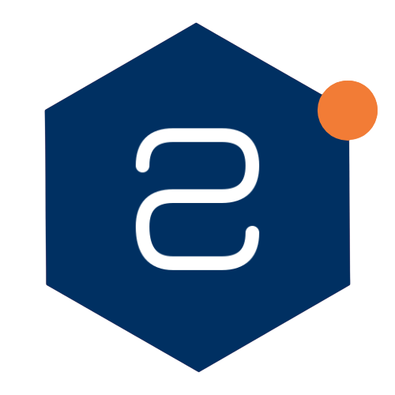
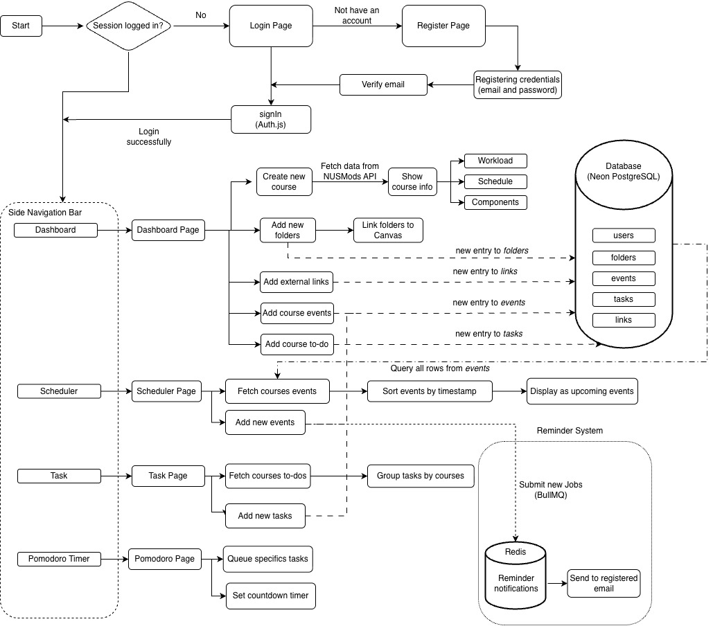
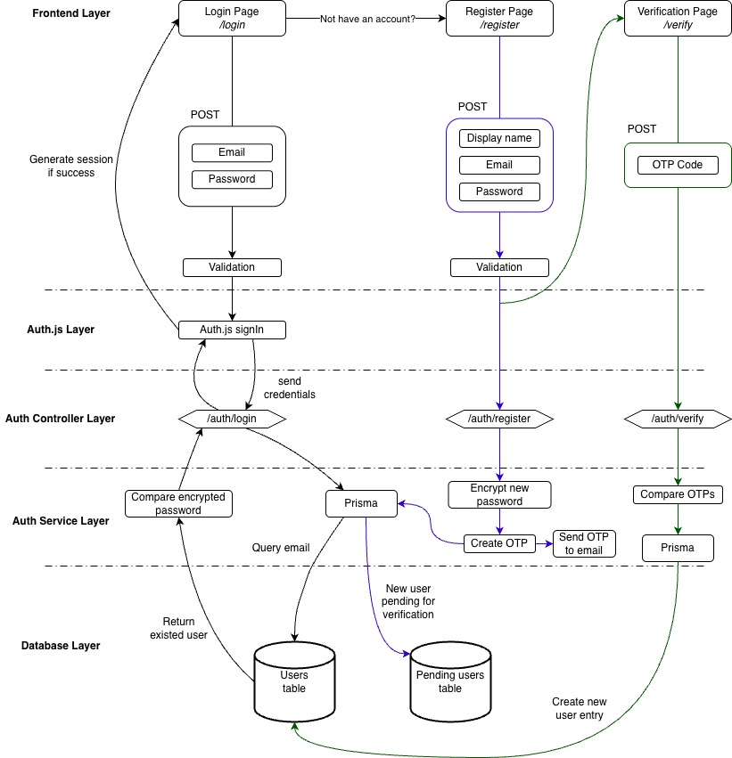
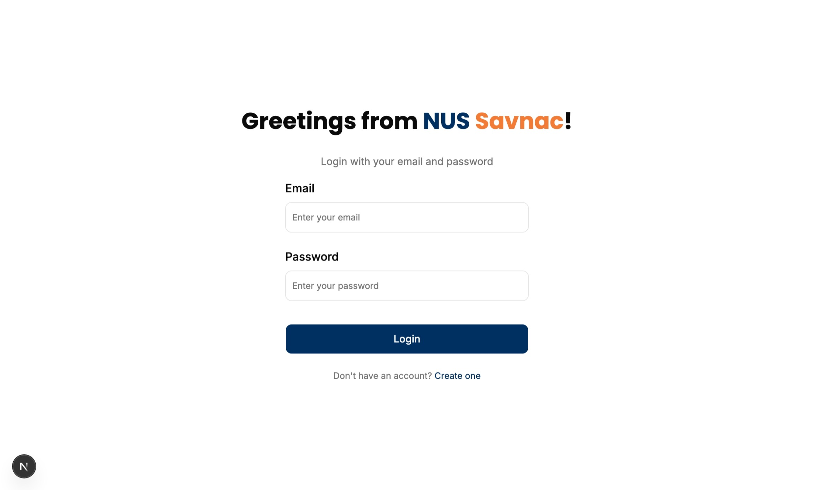
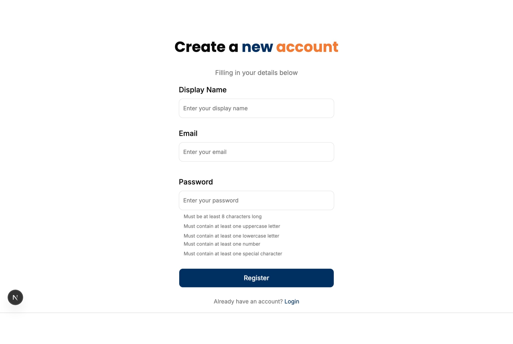
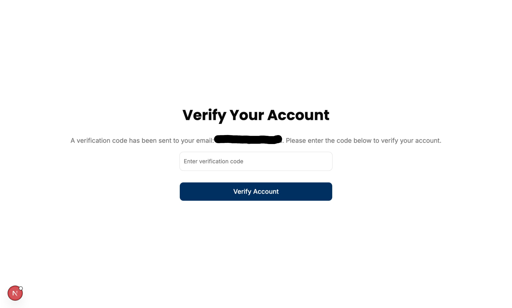

# NUS SAVNAC DOCUMENTATION

  

*Team name*
**SchedWarden**

*Project name*
**NUS Savnac**

*Production*
https://nus-savnac.vercel.app/

*For testing purposes, please use the below account*
*Email: test@gmail.com*
*Password: 123456*

## 1. Introduction

### 1.1 Motivation

The current learning ecosystem at the **National University of Singapore (NUS)** relies heavily on platforms such as ***Canvas*** and external systems such as ***Coursemology***. While these platforms provide essential functionality for course administration and content delivery, their usage often varies significantly across modules due to differences in teaching styles and course requirements. As a result, students are frequently required to navigate multiple platforms in order to access learning materials, submit assignments, complete quizzes, and track academic progress.

Furthermore, ***Canvas*** does not provide a centralized view of a student's overall academic workload. Important responsibilities such as tutorial preparation, revision sessions, project milestones, and self-directed study are often managed separately by students. This challenge is especially apparent for freshmen, who are still adapting to the increased independence and workload associated with university education.

Another limitation lies in the organization of learning resources. Although Canvas provides a *Files* section for course materials, resources are often stored within deeply nested folder structures. Students may need to repeatedly navigate through multiple layers of folders to access frequently used documents, resulting in an inefficient and repetitive workflow.

In addition, Canvas lacks integrated tools for long-term study planning, task management, and productivity tracking. Students are therefore required to rely on external applications such as calendars, task managers, and productivity tools to organize their academic commitments. The use of multiple disconnected systems creates fragmented workflows and increases the cognitive effort required to manage university life effectively.

These limitations motivated the development of **NUS Savnac**, a centralized academic management platform that aims to streamline academic organization, improve productivity, and provide students with a more unified learning experience.

### 1.2 Project Overview

***NUS Savnac*** is an academic management platform designed specifically for students of the **National University of Singapore**. The platform aims to centralize course information, study resources, schedules, and task management tools within a single application, reducing the need for students to switch between multiple systems throughout their daily academic activities.

The name *Savnac* is derived from the reverse spelling of *Canvas*, reflecting the project's goal of complementing and extending the functionality provided by the university's primary learning management system. Rather than replacing Canvas, NUS Savnac acts as a productivity-focused companion platform that helps students organize their academic responsibilities more efficiently.

The platform consists of four core features:

* **Dashboard** – Serves as the central hub of the application. Students can add NUS modules, organize course-specific resources, create custom folders containing external links, and access module information retrieved from NUSMods. The dashboard also provides a consolidated view of upcoming academic activities and course-related tasks.

* **Scheduler** – A semester-based scheduling system aligned with the NUS Academic Calendar. The scheduler aggregates module schedules and user-created events into a unified timeline, allowing students to plan their study routines and monitor upcoming commitments.

* **Task Management** – A centralized task-tracking interface that consolidates assignments, deadlines, and personal tasks across all registered courses. Tasks are organized in a structured manner to help students monitor their academic progress and maintain productivity throughout the semester.

* **Reminder System** – An automated notification system that monitors upcoming deadlines and events. Users can configure reminder intervals according to their preferences, and notifications are delivered through email to ensure important deadlines are not overlooked.

Beyond its core functionality, NUS Savnac also incorporates several productivity-enhancing features:

* **Pomodoro Timer** – Enables users to create focused study sessions by allocating time blocks to specific tasks. This feature encourages effective time management and minimizes distractions during study periods.

* **AI Advising System** – Assists students in planning their schedules and academic workload by generating personalized recommendations for study routines and task prioritization.

* **Voice Command System** – Provides a collection of predefined voice commands that allow users to interact with selected system functionalities through voice-based input, improving accessibility and convenience.

By combining academic management, scheduling, productivity tools, and intelligent assistance within a single platform, NUS Savnac aims to reduce administrative overhead and allow students to focus more effectively on learning.

### 1.3 Expectations

NUS Savnac is designed to serve as a comprehensive academic companion for NUS students. The project aims to improve the way students organize, manage, and track their academic responsibilities throughout the semester.

The system is expected to:

* Provide a centralized platform for managing courses, schedules, tasks, and study resources.
* Reduce the effort required to navigate between multiple academic systems and applications.
* Improve visibility of upcoming deadlines, events, and academic commitments.
* Encourage productive study habits through integrated productivity tools such as the Pomodoro Timer and Reminder System.
* Assist students in planning and prioritizing their workload through intelligent scheduling recommendations.
* Minimize the likelihood of missed deadlines and overlooked academic responsibilities.
* Deliver a more organized and efficient academic experience for students throughout their university journey.

Ultimately, the project seeks to reduce cognitive load associated with academic management and enable students to dedicate more time and attention to meaningful learning activities.

## 2. System Design
### 2.1. Overall Architecture
The overall architecture of the system is shown below.

  

  <em>Figure 1. Overall System Architecture</em>

The NUS Savnac system consists of four main components: the frontend application, backend services, database, and background job processing system. Users interact with the platform through a Next.js frontend, which communicates with backend services and external data sources such as the NUSMods API.

User data, tasks, events, folders, and course information are stored in a PostgreSQL database hosted on Neon. To support automated reminders, BullMQ and Redis are used to process background jobs and deliver scheduled email notifications. This architecture provides a clear separation between user interaction, data management, and asynchronous processing, ensuring maintainability and scalability.

### 2.2. Technology Stack

#### Frontend

* ***Next.js***
  A React-based framework used to build the frontend application. Next.js was chosen for its modern routing system, server-side rendering capabilities, and seamless integration with the React ecosystem.

* ***Tailwind CSS***
  A utility-first CSS framework used for styling the application. Tailwind CSS enables rapid UI development while maintaining a consistent and scalable design system.

* ***shadcn/ui***
  A collection of reusable and customizable UI components built on top of Radix UI and Tailwind CSS. It was selected to accelerate development while maintaining full control over component styling and behavior.

* ***Framer Motion***
  An animation library used to create smooth transitions and interactive user experiences. Framer Motion helps improve the overall usability and visual appeal of the application.

#### Backend

* ***NestJS***
  A progressive Node.js framework used to build the backend services. NestJS was chosen for its modular architecture, strong TypeScript support, and maintainable project structure.

* ***NUSMods API***
  An external API that provides module, timetable, and academic information from NUS. It serves as the primary source of module-related data within the application.

#### Database

* ***PostgreSQL***
  A relational database management system used for persistent data storage. PostgreSQL was selected for its reliability, performance, and strong support for complex relational data.

* ***Prisma***
  A type-safe ORM used to interact with the PostgreSQL database. Prisma simplifies database operations while improving developer productivity and reducing the likelihood of runtime errors.

#### Background Jobs

* ***BullMQ***
  A Redis-based job queue used for scheduling and processing asynchronous tasks. BullMQ enables the application to handle background operations without affecting user-facing performance.

* ***Redis***
  An in-memory data store used by BullMQ for queue management and job persistence. Redis provides high performance and low latency for background task processing.

#### Authentication

* ***Auth.js***
  An authentication framework used to manage user authentication and session handling. Auth.js was chosen for its seamless integration with Next.js and support for multiple authentication providers.

  * *Credentials (Username and Password)*
    Provides traditional account-based authentication, allowing users to securely register and log in using their email and password.

#### Deployment

* ***Vercel***
  The hosting platform used for deploying the frontend application. Vercel offers optimized support for Next.js applications and provides a streamlined deployment workflow.

* ***Railway***
  A cloud platform used to host backend services and supporting infrastructure. Railway simplifies service deployment and environment management.

* ***Neon***
  A serverless PostgreSQL platform used to host the application's database. Neon was selected for its scalability, ease of management, and seamless integration with modern cloud workflows.

#### Developer Tools

* ***Git/GitHub***
  Used for version control and collaborative development. Git and GitHub facilitate code management, feature branching, and team collaboration throughout the project lifecycle.

* ***Jest***
  A testing framework used for writing and executing unit tests. Jest helps ensure the correctness and reliability of application logic.

* ***Supertest***
  A library used for API and integration testing. Supertest allows backend endpoints to be tested in an automated and reproducible manner.

### 2.4. Authentication design
The design for authentication system is shown as below.

  

  <em>Figure 2. Authentication System Design</em>

This authentication design implements a secure credentials (email and password) registration and login system using a layered architecture. Users can sign in through the login page, where credentials are validated and authenticated against stored account data.

For new registrations, user information is validated, the password is encrypted, and a one-time password (OTP) is generated and sent via email. Registration data is temporarily stored in a `pending users` table until OTP verification is completed. Once verified, a new user record is created in the main `users` table. The system separates responsibilities across frontend, authentication middleware, controller, service, and database layers, improving maintainability, scalability, and security.

## 3. Feature Implementation
### 3.1. User Authentication
#### 3.1.1. Feature Overview
The **User Authentication** feature enables users to securely access and manage their accounts within ***NUS Savnac***. The system is built on a credentials-based authentication mechanism, allowing users to sign up and log in using their email and password.

To enhance security and ensure the validity of user accounts, the registration process includes email-based *One-Time Password (OTP)* verification. Users are required to verify their email address before completing the account creation process.

Authentication is a prerequisite for accessing protected features within the system, including the course management dashboard, scheduling tools, and task tracking functionalities.

  

  <em>Figure 3.1. Login Page</em>

  

  <em>Figure 3.2. Register Page</em>

  

  <em>Figure 3.3. Email Verification Page</em>

#### 3.1.2. Key Functionalities
- User registration by email and password
- Email OTP verification
- User login using emal and password
- Secure session management by Auth.js

#### 3.1.3. Technical Implementation
##### Credentials-Based Authentication

The credentials authentication workflow is implemented using Auth.js, PostgreSQL, and Prisma. This authentication method allows users to create and access accounts using an email-password combination.

**Login Flow**

* Users submit their email and password through the login form.
* The frontend performs basic input validation before forwarding the authentication request to Auth.js.
* Auth.js invokes the custom credentials provider, which communicates with the backend authentication service.
* The backend queries the `users` table through Prisma to retrieve the corresponding user record.
* The submitted password is compared against the stored password hash using a secure password verification algorithm.
* Upon successful verification, Auth.js creates a user session and grants access to protected application routes.
* Invalid credentials result in an authentication failure response and the user remains on the login page.

**Registration Flow**

* Users provide a display name, email address, and password through the registration form.
* Input validation is performed to ensure all required fields are present and satisfy security requirements.
* Email is restricted to be NUS email, ending with @u.nus.edu
* Passwords must:
  * Contain at least 8 characters
  * Include at least one uppercase letter
  * Include at least one lowercase letter
  * Include at least one numeric character
  * Include at least one special character
* The registration request is submitted to the `/auth/register` endpoint.
* The backend verifies that the email address is not already associated with an existing account.
* The password is securely hashed before any user data is persisted.
* A One-Time Password (OTP) is generated for email verification.
* The OTP is sent to the user's email address, while the registration information is temporarily stored in the `pending users` table through Prisma.
* Users are redirected to the verification page and must provide the received OTP.
* The verification request is submitted to the `/auth/verify` endpoint.
* The backend validates the submitted OTP against the corresponding verification record stored in the database.
* Upon successful verification, the pending registration record is promoted to a permanent account by creating a new entry in the `users` table.
* If verification fails or the OTP has expired, the account creation process is not completed and the user must request a new verification code.

### 3.2. Course Management
#### 3.2.1. Feature Overview
NUS Savnac offers course management, which is one of the main feature. With the help of NUS Mods API, NUS Savanac can fetch all courses from NUS Mods along with their datas. 
- Users can add new NUS courses at the dashboard page, and manage them (edit and deleting the courses)
- For each of the course, the course data, e.g. workloads, number of credits, exam dates, are fetched from NUS Mods API and displayed to users.
- The use of NUS Mods API helps users adding their modules of semester directly to NUS Savnac, without having to customize everything on their own.
#### 3.2.2. Key functionalities
- User can add new NUS courses to their dashboard
- User can view basic information of a course, including credits, workloads and exam dates
- User can manage their courses by editing the course name or deleting them.

#### 3.2.3. Technical implementation
- The website contains items like courses, folders, links, and they are placed in a grids, and each grid has its own mode controller. There are 3 modes corresponding to how users can interact with the items: NORMAL mode, EDIT mode and DELETE mode. This design of grids and modes are used widely across the website.

- In NORMAL mode, clicking on the item allows users to access the content of the item.
- In EDIT mode, clicking on the item allows users to make changes to the content of the item.
- In DELETE mode, clicking on the item will delete it.

- When the dashboard page is loaded, the course grid is in NORMAL mode and the system automatically fetches all courses via the endpoint `/api/course/all-courses`, which query all rows of the `Course` table that have the corresponding `userID`

- For users to add NUS modules to their dashboard, the system needs to access to *NUS Mods API* and receive all the courses by fetching the endpoint `https://api.nusmods.com/v2/2025-2026/moduleList.json`

- All the courses are then listed for users to choose for adding to the dashboard page. Users can also search for the module code for faster picking.

- When adding the course, then **Course Module** in the backend would create a new course object, post a request to the endpoint `/api/course/add-course` and add a new entry to the `Course` table in Neon. The dashboard page would then be updated with the new course added.

- When user click on the course, the system would navigate them to the course details page. This page is where the course information are displayed along with other management features. The page first fetching data from the endpoint (e.g. data for CS1101S) `https://api.nusmods.com/v2/2025-2026/modules/CS1101S.json` of NUS Mods API inorder to retrieve the course data.
- The endpoint returns an object with lots of datas, however, only the following information are extrtacted for use:
  - `moduleCode`: the course module code, e.g. *CS1101S*
  - `title`: the title of the course, e.g. *Programming Methodology*
  - `workload`: an array displaying the hours of workload
  - `credit`: the number of credits students can earned for this module
  - `semesterData`: contains the data of the classes in two semester
- The `moduleCode`,`title`, `workload` and `credit` are displayed directly on the top part of the page, while the `semesterData` is reformatted and kept for the use of ***Scheduler***.

- When user delete a course, the corresponding `courseID` would be sent to endpoint `/api/course/delete-course` and the entry would be removed from the database

### 3.3. Resources Manangement
#### 3.3.1. Feature Overview
- Resources management consists of folders and links
- In each of the created course, users can create and manage resources that are related to the course via links. 
- User can create links that allows instant access to external materials and resources.
- User can also group links of the same topic together. To do this, user can create folder of a topic, e.g. *Tutorial* and add all the related links to this folder. 
- One of a useful trick of folders and links is that stundents can create folders and link them directly to Canvas folders of the course. By this, they don't have to navigate around the folders in Canvas everytime they want to access a material. Also, students can organize the folders in a way that match their own convenience, instead of being limited by the concrete structure of the course on Canvas.
- Folders and links are placed in grids that have modes, which means they can access, edit or delete the items easily.

#### 3.3.2. Key functionalities
- User can create links to make instant access to external materials, resources, study platforms
- User can group related links together using folders
- User are also able to make changes to the names and urls of folders, links or remove them from the courses

#### 3.3.3. Technical implementation
- When users access the detail page of a course, the system will query at the backend endpoint `/api/folder/all-folders` to get all rows of the left join between two tables `Folders` and `Links`
- Every course has a special folder called `__general__`. This folder is not displayed on screen as an item in the grid, but is used to store the links that are non-related to any topics, while maintaining the consistency between all folders no matter their kind (i.e. no need to have another set of function to manipulate the non-topic links)
- The **folders** and the **links** of `__general__` folder are placed in a grid with modes.
- Other endpoints in the CRUD set of manipulating folders and links are:
  - `/api/folder/add-folder`: For adding folder
  - `/api/folder/update-folder`: For updating folder
  - `/api/folder/delete-folder`: For deleting folder
  - `/api/link/create-link`: For creating link, the `folderID` of the folder which this link belongs to need to be specified
  - `/api/link/update-link`: For updating link title and url
  - `/api/link/delete-link`: For deleting link from folders

- When user clicks on the a folder, there will be a right panel opens and displays the selected folder's content. Thus, there is a `selectedFolder` variable which keep track of the current folder to be displayed, and by default, when no folder is selected, `selectedFolder` is the `__general__` folder.

### 3.4. Scheduler
#### 3.4.1. Feature Overview
- This feature is the events and classes management. This consists of the event calendar that appears that every course detail page and the **Scheduler Page**
- The unit of this feature is *event*. Every event consists of basic information like title, time, venue, etc. Every event also has a type, which categorize the event and give it a different color to be displayed on the calendar. There are 4 types of events defined:
  - CLASSES: lectures, tutorial sessions, etc.
  - DEADLINES: deadlines for projects, assignments
  - EXAMS: the final exams are obvious. However, mid-term tests or continual assessments quizzes, tests have to be taken notes and managed by students themselves
  - OTHERS: for other types of events such as meetings, conferences, workshops, etc.

- The event calendar is placed at the end of every course details, displaying the events and classes of this course. This calendar is inspired from **Google Calendar**. However, it is reformatted to display the events in a manner that is specialized for NUS students. Instead of dates, the calendar consists of weeks and days. Weeks are the NUS Calendar weeks, from Week 1 to Week 13 and also includes the Recess Week, Reading Week and Exam Week.
- The **Scheduler Page** also has the event calendar like the one in the course pages. But this calendar is bigger and consists all the events of all courses. This gives the users an overview of events and classes that they have across all courses. There are also lists that displayed the upcoming events of every type so that users will be able to know which deadlines or exams are coming.
#### 3.4.2. Key functionalities
- For each course, user can view its events
- User can add classes to the course as well as adding new events by specifying week, day, and time
- User can navigate around the calendar by jumping to a specific week
- User can click on an event to view its details, make changes to it or delete the event
- On the **Scheduler Page**, users can view the events of all courses, and the upcoming events of each category

#### 3.4.3. Technical implementation

### 3.5. Task Management
#### 3.5.1. Feature Overview

#### 3.5.2. Key functionalities

#### 3.5.3. Technical implementation

### 3.6. Pomodoro
#### 3.6.1. Feature Overview

#### 3.6.2. Key functionalities

#### 3.6.3. Technical implementation

## 4. User Guide

